# 位元陣列

[toc]

## 類別概述

`位元陣列` 是一個用於位元操作的資料結構，支援高效的二進位管理與操作。本類別提供了靈活的初始化方式（字串或數值），並支援位元運算（`AND`、`OR`、`XOR`）和位元管理操作（設置、讀取、反轉等）。主要用途包括管理和處理位元級別的資料，適合用於壓縮存儲及高效操作。

###  類別圖

以下為 `位元陣列` 類別的類別圖：


```mermaid
classDiagram
    class 位元陣列 {
        #一頁可記錄的位元數
        #數量
        #頁面
        #四位元組
        +and(另一個陣列): 位元陣列
        +not(): 位元陣列
        +or(另一個陣列): 位元陣列
        +xor(另一個陣列): 位元陣列
        +狀態(位元編號): boolean
        +複製(): 位元陣列
        +解析二進位字串(字串): 位元陣列
        +設定全部狀態(狀態): 位元陣列
        +設定狀態(位元編號, 狀態): 位元陣列
        +轉為二進位字串(): string
        #執行邏輯運算(另一個向量, 運算符): 位元陣列
        #確保二進位字串只有0和1的字元(字串)
        #確定位元編號在範圍內(位元編號)
        #計算需要的頁面數量(位元數量): number
        #設定位元數量(新數量)
        #驗證(條件, 錯誤類別, 錯誤訊息)
        #取得頁面編號(位元編號): number
    }
```

------

## Public Methods 說明

### `and` 方法

#### 功能概述

`and` 方法用於執行兩個位元陣列間的邏輯 AND 運算。該方法會逐位元地比較兩個位元陣列中對應位置上的位元值，若兩位元皆為 `1`，結果位元為 `1`，否則結果位元為 `0`。結果將以一個新的位元陣列回傳。

#### 技術結構

1. 確認傳入的 `另一個陣列` 與當前位元陣列的位元數量相同，否則拋出錯誤。
2. 使用逐位元邏輯 AND 運算符 (`&`)，對整個位元陣列進行運算。
3. 回傳一個新的位元陣列，包含運算結果。

------

#### 參數規格與回傳

##### 參數規格

| 參數名稱     | 類型       | 描述                                                         | 是否必要 |
| ------------ | ---------- | ------------------------------------------------------------ | -------- |
| `另一個陣列` | `位元陣列` | 用於進行 AND 運算的另一個位元陣列，<br />需與當前陣列位元數量相同 | 是       |

##### 回傳值

| 回傳值     | 類型       | 描述                                            |
| ---------- | ---------- | ----------------------------------------------- |
| `結果陣列` | `位元陣列` | 包含兩個位元陣列進行 AND 運算後結果的新位元陣列 |

------

#### 循序圖

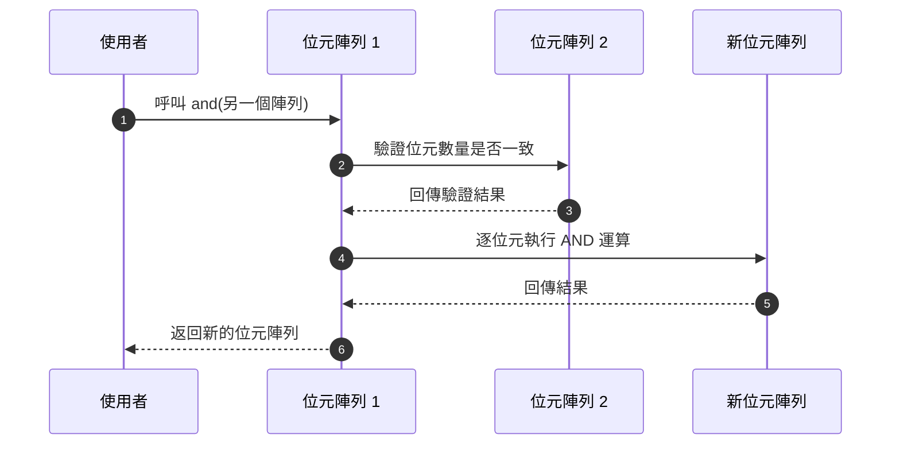
```mermaid
sequenceDiagram
    autoNumber
    participant User as 使用者
    participant BitArray1 as 位元陣列 1
    participant BitArray2 as 位元陣列 2
    participant NewBitArray as 新位元陣列
    User->>BitArray1: 呼叫 and(另一個陣列)
    BitArray1->>BitArray2: 驗證位元數量是否一致
    BitArray2-->>BitArray1: 回傳驗證結果
    BitArray1->>NewBitArray: 逐位元執行 AND 運算
    NewBitArray-->>BitArray1: 回傳結果
    BitArray1-->>User: 返回新的位元陣列
```

------

#### 程式邏輯

1. 驗證傳入的 

   ```
   另一個陣列
   ```

   - 檢查是否與當前位元陣列擁有相同的位元數量。
   - 若位元數量不符，則拋出 `參數錯誤`。

2. 定義運算函數：

   - 使用內部 `#執行邏輯運算` 方法，傳入運算符 `'and'` 與 `另一個陣列`。

3. 運算邏輯：

   - 逐頁面對應執行 AND 運算，即對每個頁面的 32 位元資料進行逐位元處理。
   - 使用邏輯運算符 `&` 計算結果。

4. 結果回傳：

   - 此運算的結果儲存於新的位元陣列中，並作為回傳值。

------

### `not`

#### 功能概述

`not`用於對當前位元陣列的每個位元進行位元反轉（NOT 運算），即將所有的 `0` 反轉為 `1`，而 `1` 反轉為 `0`。此方法會返回一個新的位元陣列作為運算結果，而不會改變原始位元陣列的內容。

------

#### 技術結構

此方法的工作流程如下：

1. 建立一個新的位元陣列，其大小與當前位元陣列相同。
2. 對每個頁面的數值進行位元反轉運算（使用 JavaScript 的位元運算符 `~`）。
3. 將反轉後的頁面資料存入新位元陣列。
4. 返回新的位元陣列，代表反轉結果。

------

#### 參數規格與回傳

**參數：**

此方法不需要參數。

| 參數名稱 | 類型 | 描述           | 必要性 |
| -------- | ---- | -------------- | ------ |
| 無       | -    | 無參數需要傳遞 | -      |

**回傳值：**

| 回傳值     | 類型       | 描述                                                         |
| ---------- | ---------- | ------------------------------------------------------------ |
| 新位元陣列 | `位元陣列` | 包含當前位元陣列中每個位元反轉後的結果，這是一個全新的位元陣列實例。 |

------

#### 循序圖


```mermaid
sequenceDiagram
    autoNumber
    participant 使用者
    participant 位元陣列
    note over 位元陣列: 初始化新的位元陣列 (`回傳結果`)
    使用者 ->> 位元陣列: 呼叫 `not()`
    位元陣列 ->> 位元陣列: 遍歷內部頁面陣列
    loop 每個位元頁面
        位元陣列 ->> 位元陣列: 執行位元反轉 (~)
        位元陣列 ->> 回傳結果: 保存處理後的頁面資料
    end
    位元陣列 ->> 使用者: 回傳新的位元陣列
```

------

#### 程式邏輯

1. **建立新位元陣列：**
      依據當前位元陣列的大小，初始化一個新的位元陣列物件，用以存放反轉後的結果。
2. **遍歷頁面：**
      遍歷位元陣列的每個頁面(`#頁面`)。
3. **執行反轉運算：**
      使用位元運算符 `~` 對頁面內容逐位元進行反轉操作。
4. **保存反轉結果：**
      將反轉後的結果存入新位元陣列的頁面結構中。
5. **返回新陣列：**
      返回包含反轉後結果的位元陣列。

------

### `or`
#### 功能概述
`or` 方法用於將當前位元陣列與另一個位元陣列進行位元級別的 OR（或）運算，並產生一個新的位元陣列結果。該方法會逐位對應操作，透過 OR 運算取得輸出值，並適用於兩陣列具有相同位元數量的情況。
#### 技術結構
該方法採用以下技術設計：
1. **輸入驗證**：確保提供的另一個位元陣列與當前陣列具有相同的位元數量，否則會拋出參數錯誤。
2. **邏輯運算實現**：使用內部私有方法 `#執行邏輯運算`，指定運算符為 `or`，完成逐位運算。
3. **新陣列產生**：運算結果會存放於一個新的位元陣列物件中，並以該物件作為回傳值。

#### 參數規格與回傳
##### 參數說明

| 參數名稱 | 類型 | 描述 | 必要性 |
| --- | --- | --- | --- |
| 另一個陣列 | 位元陣列 | 欲進行 OR 運算的位元陣列，其位元數必須與當前陣列相同 | 必須 |
##### 回傳值

| 回傳值 | 類型 | 描述 |
| --- | --- | --- |
| 新的位元陣列 | 位元陣列 | 包含執行 OR 運算後，結果的更改後位元陣列物件 |

#### 循序圖

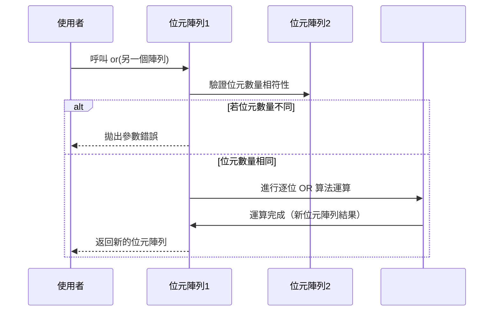
``` mermaid
sequenceDiagram
    participant User as 使用者
    participant BitArray1 as 位元陣列1
    participant BitArray2 as 位元陣列2
    participant Internal as #執行邏輯運算
    User->>BitArray1: 呼叫 or(另一個陣列)
    BitArray1->>BitArray2: 驗證位元數量相符性
    alt 若位元數量不同
        BitArray1-->>User: 拋出參數錯誤
    else 位元數量相同
        BitArray1->>Internal: 進行逐位 OR 算法運算
        Internal->>BitArray1: 運算完成（新位元陣列結果）
        BitArray1-->>User: 返回新的位元陣列
    end
```
#### 程式邏輯
`or` 方法的實現邏輯如下：
1. **輸入驗證**：使用內部方法檢查 `另一個陣列` 的位元數量是否等於當前位元陣列的位元數量。如不一致則拋出 `參數錯誤`。
2. **邏輯運算**：將邏輯操作委派給內部私有方法 `#執行邏輯運算`，並傳入操作符 `or`。
3. **結果返回**：從內部方法中取得新的位元陣列作為運算結果並回傳

------

### `xor`

#### 功能概述

`xor`執行當前位元陣列與另一個位元陣列之間的 XOR 運算。對每個位元進行邏輯 XOR 操作，並將結果存儲於一個新的位元陣列中作為結果返回。此方法可用於進行位元元模式的比較和差異分析操作。

#### 技術結構

1. 接收一個與當前位元陣列長度相等的另一個位元陣列作為操作物件。
2. 驗證兩個位元陣列的長度是否一致，若不一致則拋出參數錯誤。
3. 運用 XOR 運算符（`^`），逐頁對兩個位元陣列進行運算。
4. 輸出一個新的位元陣列實例，包含運算結果的位元資料。

#### 參數規格與回傳

| **參數名稱** | **類型**   | **描述**                                          | **必要性** |
| ------------ | ---------- | ------------------------------------------------- | ---------- |
| 另一個陣列   | `位元陣列` | 用於進行 XOR 運算的另一個位元陣列（需長度相等）。 | 必須       |

回傳值：

| **回傳值** | **類型**   | **描述**                          |
| ---------- | ---------- | --------------------------------- |
| 運算結果   | `位元陣列` | 包含 XOR 運算結果的位元陣列實例。 |

#### 循序圖

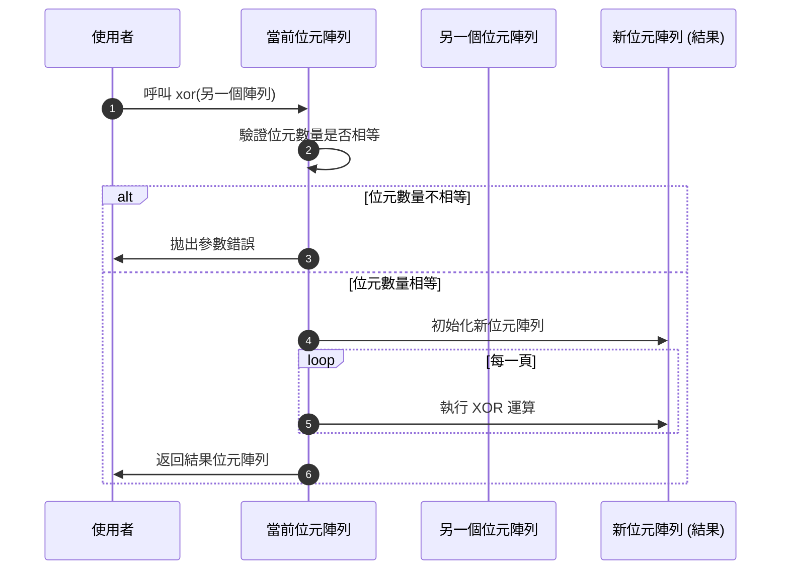
```mermaid
sequenceDiagram
  autoNumber
  participant User as 使用者
  participant CurrentArray as 當前位元陣列
  participant AnotherArray as 另一個位元陣列
  participant ResultArray as 新位元陣列 (結果)

  User->>CurrentArray: 呼叫 xor(另一個陣列)
  CurrentArray->>CurrentArray: 驗證位元數量是否相等
  alt 位元數量不相等
    CurrentArray->>User: 拋出參數錯誤
  else 位元數量相等
    CurrentArray->>ResultArray: 初始化新位元陣列
    loop 每一頁
      CurrentArray->>ResultArray: 執行 XOR 運算
    end
    CurrentArray->>User: 返回結果位元陣列
  end
```

#### 程式邏輯

1. **參數驗證**：檢查傳入的位元陣列是否與當前位元陣列具有相同的位元數量，若不同則拋出參數錯誤。

2. 運算操作

   ：基於另一次數組，逐頁（根據分頁大小）進行位元的 XOR（異或）運算：

   - 計算每頁的資料，對應位元與運算結果儲存在新位元陣列內。
   - 每一整頁位元資料使用 JavaScript 的二元 XOR 運算符（`^`）。

3. **結果返回**：將包含 XOR 運算結果的新位元陣列返回給使用者。

------

### `狀態` 

#### 功能概述

`狀態`用於查詢位於指定位元位置的狀態值（布林值）。通過傳入位元編號，方法會返回該編號對應位置的位元是否為 1。若值為 1，則返回 `true`，否則返回 `false`。

#### 技術結構

該方法依賴內部的 **分頁存儲結構**，通過計算位元所在的頁面及在頁面中的位置，執行有效查詢並返回結果。同時，該方法會進行必要的參數驗證，確保位元編號合法，且避免索引錯誤。

------

#### 參數規格與回傳

##### 參數

| **參數名稱** | **類型** | **描述**                                                     | **必要性** |
| ------------ | -------- | ------------------------------------------------------------ | ---------- |
| 位元編號     | `number` | 欲查詢的位元編號必須為非負整數，且小於當前位元陣列的總位元數量。 | 是         |

##### 回傳值

| **回傳值** | **類型**  | **描述**                                                  |
| ---------- | --------- | --------------------------------------------------------- |
| 位元狀態   | `boolean` | 如果指定位置的位元為 `1`，返回 `true`，否則返回 `false`。 |

------

#### 循序圖

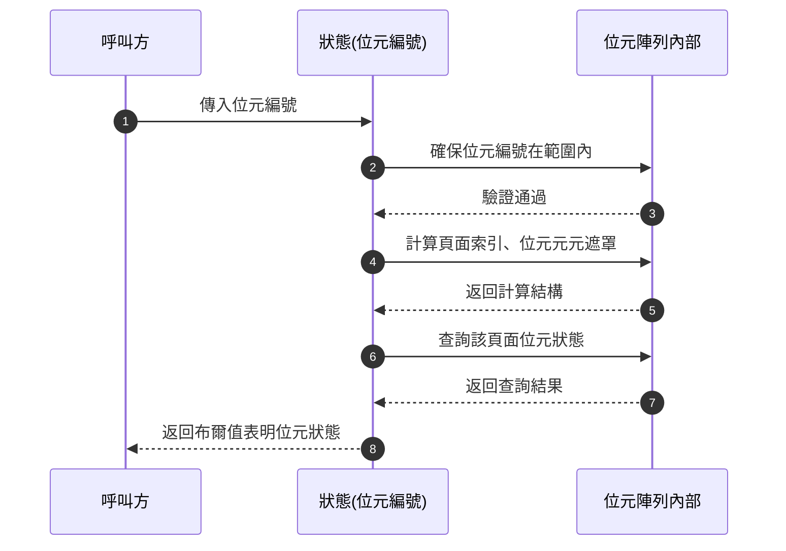
```mermaid
sequenceDiagram
    autoNumber
    participant Client as 呼叫方
    participant Method as 狀態(位元編號)
    participant Internal as 位元陣列內部
    Client->>Method: 傳入位元編號
    Method->>Internal: 確保位元編號在範圍內
    Internal-->>Method: 驗證通過
    Method->>Internal: 計算頁面索引、位元元元遮罩
    Internal-->>Method: 返回計算結構
    Method->>Internal: 查詢該頁面位元狀態
    Internal-->>Method: 返回查詢結果
    Method-->>Client: 返回布爾值表明位元狀態
```

------

#### 程式邏輯

1. **參數驗證**：
   - 使用內部私有方法 `#確定位元編號在範圍內` 驗證提供的位元編號是否為合法值。
   - 如果位元編號非法，則拋出相應的錯誤（例如：`型別錯誤` 或 `索引超出範圍錯誤`）。
2. **頁面計算**：
   - 根據提供的位元編號計算該位元在內部頁面資料結構中的分頁位置：     
     - 頁面索引 = `Math.floor(位元編號 / 一頁可紀錄位元數)`。
     - 位元遮罩 = `1 << (位元編號 % 一頁可紀錄位元數)`。
3. **位元查詢**：
   - 通過位元遮罩和位元在分頁中的偏移量，獲取該位置的位元狀態（0 或 1）。
4. **返回值**：
   - 如果位元狀態為 `1`，返回 `true`；
   - 如果位元狀態為 `0`，返回 `false`。

這種設計確保了查詢操作的效率，同時借助分頁結構減少了內存使用，提高了執行性能。

------

### `複製`

#### 功能概述

`複製`用於建立並返回當前 **位元陣列**（`位元陣列` 類的例項）的完整複本。該方法實現位元陣列的深層拷貝，確保複製的陣列獨立於原始陣列，且不會影響彼此的後續操作。

------

#### 技術結構

`複製`內部使用 JavaScript 的陣列拷貝功能進行高效的分頁資料複製，並維持頁面記錄的完整性與位元運算結果不變。本方法不修改原始的 `位元陣列`，只生成一個全新的實例。

------

#### 參數規格與回傳

| 參數名稱 | 類型 | 描述                       | 必要性 |
| -------- | ---- | -------------------------- | ------ |
| 無       | 無   | 本方法不接受任何輸入參數。 | N/A    |

| 回傳值                 | 類型       | 描述                                       |
| ---------------------- | ---------- | ------------------------------------------ |
| 新位元陣列（複製參數） | `位元陣列` | 內容與原來的位元陣列相同的新位元陣列實例。 |

------

#### 循序圖

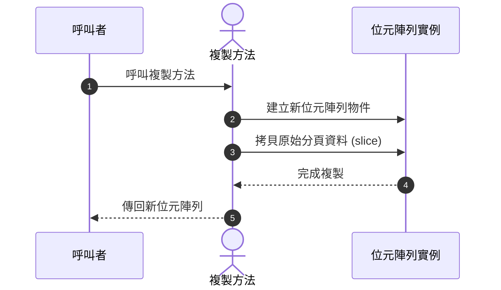
```mermaid
sequenceDiagram
    autoNumber
    participant Caller as 呼叫者
    actor 複製 as 複製方法
    participant 位元陣列 as 位元陣列實例
    Caller ->> 複製: 呼叫複製方法
    複製 ->> 位元陣列: 建立新位元陣列物件
    複製 ->> 位元陣列: 拷貝原始分頁資料 (slice)
    位元陣列 -->> 複製: 完成複製
    複製 -->> Caller: 傳回新位元陣列
```

------

#### 程式邏輯

1. **初始化新位元陣列**
      使用當前 `位元陣列` 的位元數量（`數量`屬性），建立具有相同長度的新 `位元陣列` 實例。
2. **拷貝分頁資料**
      透過陣列的 `slice`，將目前儲存位元的分頁（`#頁面`屬性）資料完整拷貝，避免共用同一記憶體位置。
3. **返回複本**
      返回新建的位元陣列實例。新位元陣列的內容與原始陣列一致，但兩者相互獨立，不會有任何改動影響對方。 

------

### `解析二進位字串`

#### 功能概述
`解析二進位字串` 方法用來對二進位格式的字串進行解析，並將其轉換為位元陣列的內部結構。  
它支援處理二進位字串中的多餘空白字元，並於轉換過程中檢查字元是否合法（僅允許 `0` 或 `1`）。  
此方法主要用於初始化位元陣列或更新其內容。

#### 技術結構
- 此方法首先透過字串工具移除字串中的空白，然後進行合法性檢查。
- 解析結果會依頁面分配的位元數量進行分頁儲存，每頁資料以整數形式存儲。
- 該方法支援動態調整位元陣列大小。

#### 參數規格與回傳

##### 參數

| 參數名稱   | 類型     | 描述                         | 必要性 |
|------------|----------|------------------------------|--------|
| 二進位字串 | `string` | 要解析的二進位數字字串，僅允許包含 `0` 和 `1`，可混雜空白字元 | 必要   |

##### 回傳值

| 回傳值       | 類型         | 描述                                 |
|--------------|--------------|--------------------------------------|
| 當前位元陣列 | `位元陣列`  | 包含解析結果的位元陣列，支援鏈式調用 |

#### 循序圖
以下使用 Mermaid.js 描述此方法的執行流程：

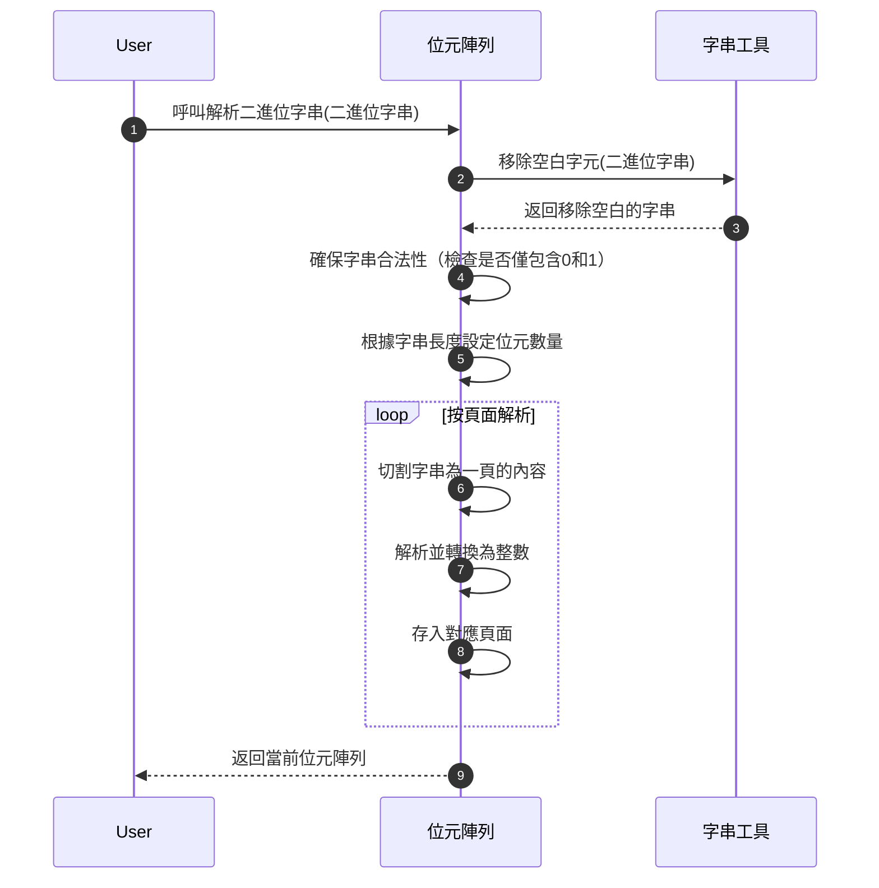
```mermaid
sequenceDiagram
    autoNumber
    participant User
    participant BitArray as 位元陣列
    participant Tool as 字串工具

    User->>BitArray: 呼叫解析二進位字串(二進位字串)
    BitArray->>Tool: 移除空白字元(二進位字串)
    Tool-->>BitArray: 返回移除空白的字串
    BitArray->>BitArray: 確保字串合法性（檢查是否僅包含0和1）
    BitArray->>BitArray: 根據字串長度設定位元數量
    loop 按頁面解析
        BitArray->>BitArray: 切割字串為一頁的內容
        BitArray->>BitArray: 解析並轉換為整數
        BitArray->>BitArray: 存入對應頁面
    end
    BitArray-->>User: 返回當前位元陣列
```

#### 程式邏輯
1. 使用 `字串工具.移除空白字元` 方法處理傳入的二進位字串，移除所有空白字元。
2. 調用私有方法 `#確保二進位字串只有0和1的字元`，確保字串中僅包含合法的二進位字元，否則拋出錯誤。
3. 根據字串的長度設定位元陣列的大小，包含頁面數的調整。
4. 以頁面為單位逐步解析字串中的二進位資料，將每頁轉換為整數並存入內部頁面結構。
5. 返回 `this`（當前位元陣列），支援鏈式調用。

------

### `設定全部狀態`

#### 功能概述

`設定全部狀態` 是 `位元陣列` 中用來將位元陣列的所有位元進行快速統一設置的功能。
 方法接受一個布林值參數，將所有位元設為 `1`（若參數為 `true`）或 `0`（若參數為 `false`）。該操作會影響整個位元陣列中的所有位元，並可支援鏈式呼叫。

#### 技術結構

1. 該方法基於內部的 `#頁面` 陣列進行操作，將每個頁面的資料以統一值進行填充。
2. 根據傳入的布林值確定填充值：  
   - 若為 `true`，則填充最大可表示的值（對應所有位元為 1，如 `0xFFFFFF`）。  
   - 若為 `false`，則填充 0（所有位元為 0，如 `0x000000`）。  
3. 填充操作透過內建的陣列 `.fill()`高效完成。

------

#### 參數規格與回傳

| 參數名稱 | 類型    | 描述                             | 必要性 |
| -------- | ------- | -------------------------------- | ------ |
| 狀態     | boolean | 設定所有位元的目標狀態，為布林值 | 必填   |

**回傳值**

- 此方法返回當前的位元陣列物件（`位元陣列`），以支援鏈式呼叫。

------

#### 循序圖

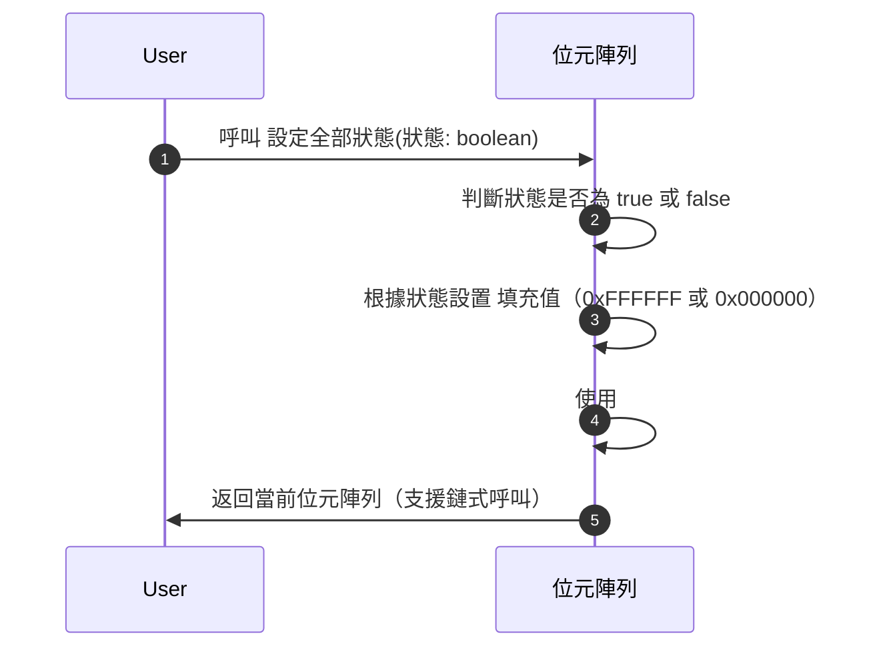
```mermaid
sequenceDiagram
    autoNumber
    participant User
    participant 位元陣列
    User->>位元陣列: 呼叫 設定全部狀態(狀態: boolean)
    位元陣列->>位元陣列: 判斷狀態是否為 true 或 false
    位元陣列->>位元陣列: 根據狀態設置 填充值（0xFFFFFF 或 0x000000）
    位元陣列->>位元陣列: 使用 #頁面.fill(填充值) 完全覆蓋頁面內容
    位元陣列->>User: 返回當前位元陣列（支援鏈式呼叫）
```

------

#### 程式邏輯

1. 接收一個布林值參數 `狀態`。

2. 判斷 

   ```
   狀態
   ```

    值：

   - 若為 `true`，將 `填充值` 設置為 `0xFFFFFF`（二進位 `111111`，表示所有位元設為 1）。
   - 若為 `false`，將 `填充值` 設置為 `0x000000`（二進位 `000000`，表示所有位元設為 0）。

3. 透過內部的 `#頁面` 陣列中的 `.fill()`，將陣列所有單元修改為對應的 `填充值`。

4. 返回當前的位元陣列，以支援方法鏈式呼叫。  

該方法的設計確保了高效操作整個位元陣列，無需逐一設置每個位元狀態，也因此在處理大規模位元資料時尤為高效。

------

### `設定狀態`

#### 功能概述

`設定狀態`允許使用者指定位於位元陣列中的某個位元的狀態（0 或 1）。此功能適用於需要精確控制單一位元運作的場景。例如，啟用標記、保存狀態或執行位元層級運算。

------

#### 技術結構

此方法利用內部私有屬性記錄位元資料，並以位元遮罩進行按位操作：

- **寫入 1（啟用）**: 運用位元遮罩與 `OR` 運算符 (`|`)。
- **寫入 0（停用）**: 使用遮罩的反向與 `AND` 運算符 (`&`)。

內部邏輯確保：

1. 位元編號的有效性（範圍檢查）。
2. 根據位元編號計算位於內部頁面的對應位置。

------

#### 參數規格與回傳

| **參數名稱** | **類型**  | **描述**                                        | **必要性** |
| ------------ | --------- | ----------------------------------------------- | ---------- |
| `位元編號`   | `number`  | 欲設定的位元元元位置（索引）。                      | 必須       |
| `狀態`       | `boolean` | 指定位元的目標狀態，`true` 為 1；`false` 為 0。 | 必須       |

**回傳值**

- 類型: `位元陣列`
- 描述: 回傳的是自身實例，以支援鏈式呼叫。

**可能拋出的例外:**

- **型別錯誤** (`型別錯誤`): 如果 `位元編號` 不是數字，則會拋出此錯誤。
- **索引超出範圍錯誤** (`索引超出範圍錯誤`): 如果 `位元編號` 超出合法範圍（即大於現有位元），會拋此例外。

------

#### 循序圖

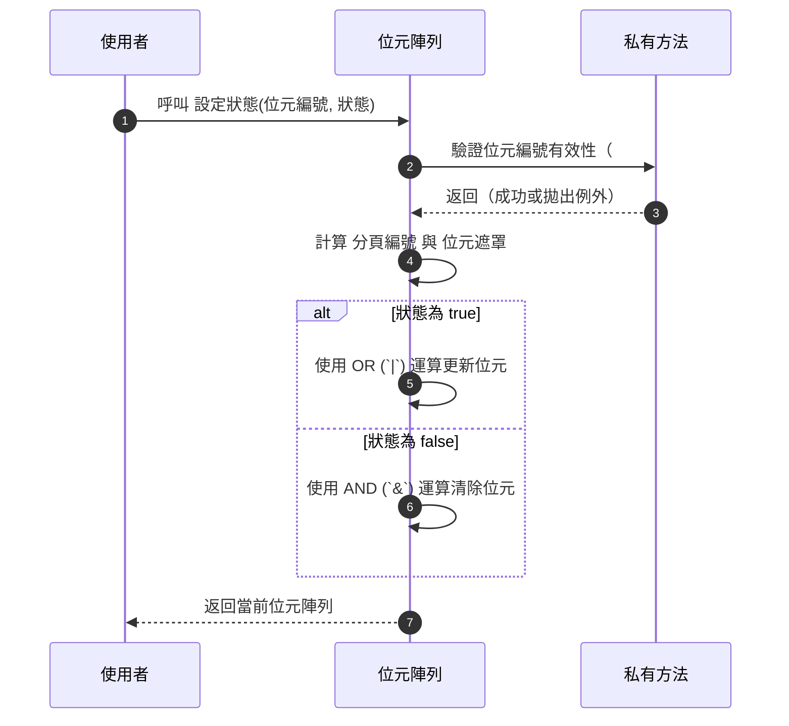
```mermaid
sequenceDiagram
    autoNumber
    participant 使用者 as 使用者
    participant 位元陣列 as 位元陣列
    participant 私有方法 as 私有方法
    
    使用者->>位元陣列: 呼叫 設定狀態(位元編號, 狀態)
    位元陣列->>私有方法: 驗證位元編號有效性（#確定位元編號在範圍內）
    私有方法-->>位元陣列: 返回（成功或拋出例外）
    位元陣列->>位元陣列: 計算 分頁編號 與 位元遮罩
    alt 狀態為 true
        位元陣列->>位元陣列: 使用 OR (`|`) 運算更新位元
    else 狀態為 false
        位元陣列->>位元陣列: 使用 AND (`&`) 運算清除位元
    end
    位元陣列-->>使用者: 返回當前位元陣列
```

------

#### 程式邏輯

1. 驗證目標位元編號是否合法 (內部方法 `#確定位元編號在範圍內`)：
   - 驗證是否為數值。
   - 驗證是否介於 `0` 和 `位元陣列.數量 - 1` 之間。
2. 計算位元的位置資訊：
   - 分頁編號：`位元編號` 所屬的頁面，基於 `Math.floor(位元編號 / 每頁位元數)` 計算。
   - 二進位遮罩：用於特定位元位置的操作，計算公式為 `1 << (位元編號 % 每頁位元數)`。
3. 更新位元狀態：
   - 若狀態為 `true`（設為 1）：透過運算 `頁面[分頁編號] |= 位元遮罩`。
   - 若狀態為 `false`（設為 0）：進行清除操作，即 `頁面[分頁編號] &= ~位元遮罩`。
4. 返回修改後的位元陣列物件（支援鏈式呼叫）。

------

### `轉為二進位字串`
#### 功能概述
將當前位元陣列中的所有位元狀態轉換為以 `01` 表示的二進位字串。此方法適用於將位元資料轉換為可讀的文字表示形式，從而便於輸出或進行文檔處理。
#### 技術結構
1. 根據每一頁的位元數（以 4 位元為單位）進行分段處理。
2. 利用 `四位元組` 私有靜態屬性進行快速查詢和轉換。
3. 展開每一頁的位元資料，將其轉換為對應的 4 位元的二進位字串。
4. 整理結果並倒序排列後，刪除多餘位元以保持與實際位元數量一致。

#### 參數規格與回傳
##### 方法參數
此方法不接受任何參數。
##### 回傳值

| **回傳值** | **類型** | **描述** |
| --- | --- | --- |
| 二進位字串 | `string` | 由 `01` 組成的字符串，表示當前位元陣列的位元狀態，長度對應位元數量。 |
#### 循序圖
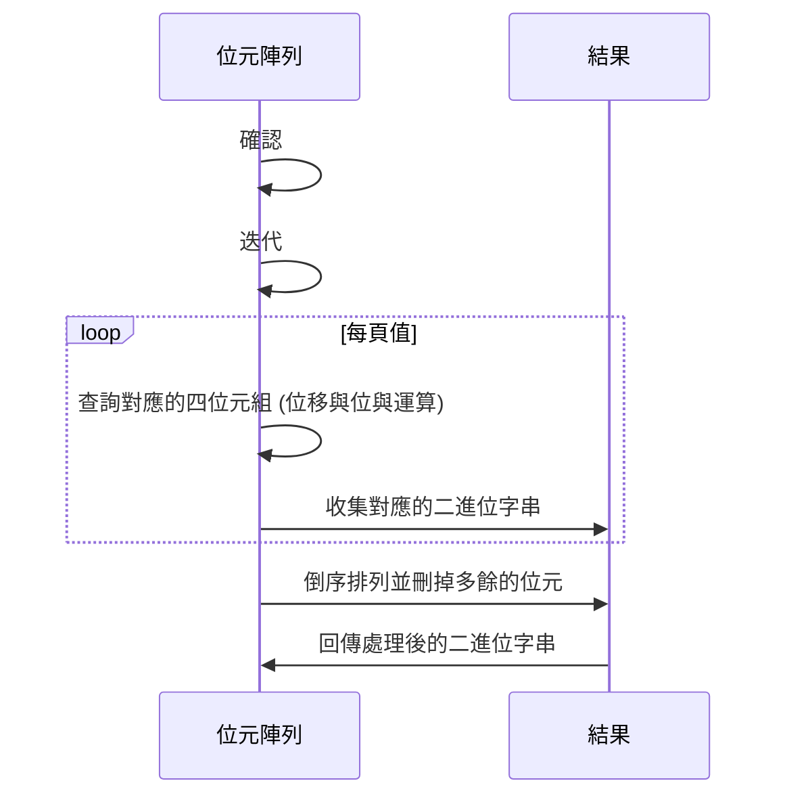
``` mermaid
sequenceDiagram
    participant 位元陣列
    participant 結果
    位元陣列->>位元陣列: 確認 #數量 與 #頁面值
    位元陣列->>位元陣列: 迭代 #頁面 的值
    loop 每頁值
        位元陣列->>位元陣列: 查詢對應的四位元組 (位移與位與運算)
        位元陣列->>結果: 收集對應的二進位字串
    end
    位元陣列->>結果: 倒序排列並刪掉多餘的位元
    結果->>位元陣列: 回傳處理後的二進位字串
```
#### 程式邏輯
1. 設定每一頁的位元數對應的 `四位元組` 長度 (`#一頁可記錄的位元數 / 4`)。
2. 使用 `flatMap` 和迴圈將每一頁的數值轉換為二進位字串：
    - 計算每一位元資料的位移量。
    - 使用位元移位 (`>>`) 和位元遮罩 (`& 0x0000000F`) 來抓取該位的數值。
    - 查詢 `四位元組` 陣列以取得對應的二進位子字串。

3. 從 `#頁面` 中抓取的二進位字串會被 **倒序排列**。
4. 裁切字串，使其符合目前位元陣列所設定的位元數量（`#數量`）。
5. 將所有子字串拼接後回傳，形成最終的二進位字串。

------

## Private Methods 說明

### `取得頁面編號`

#### 功能概述

`取得頁面編號` 是一個私有方法，用於計算給定位元編號所在的頁面編號。由於位元元陣列是按照分頁方式管理位元元資料，此方法根據當前每頁可紀錄的位元數 (`#一頁可記錄的位元數`) 計算指定位元編號的對應頁面編號，頁面從 `0` 開始。

#### 技術結構

該方法使用數學公式 `Math.floor(位元編號 / 每頁可紀錄位元數)` 來計算給定位元編號所屬的頁面編號。頁面編號用於定位位元在內部陣列的存儲位置。

- **方法私有**：僅在內部呼叫，確保外部無法直接使用此功能。
- **無錯誤檢查**：假設傳入的位元編號已被驗證為合法值。

#### 參數規格與回傳

| 參數名稱   | 類型     | 描述                           | 必要性 |
| ---------- | -------- | ------------------------------ | ------ |
| `位元編號` | `number` | 欲查詢的位元編號，需為非負整數 | 必須   |

**回傳值**

| 回傳值   | 類型     | 描述                                      |
| -------- | -------- | ----------------------------------------- |
| 頁面編號 | `number` | 該位元編號所屬的頁面編號，從 `0` 開始計算 |

#### 循序圖

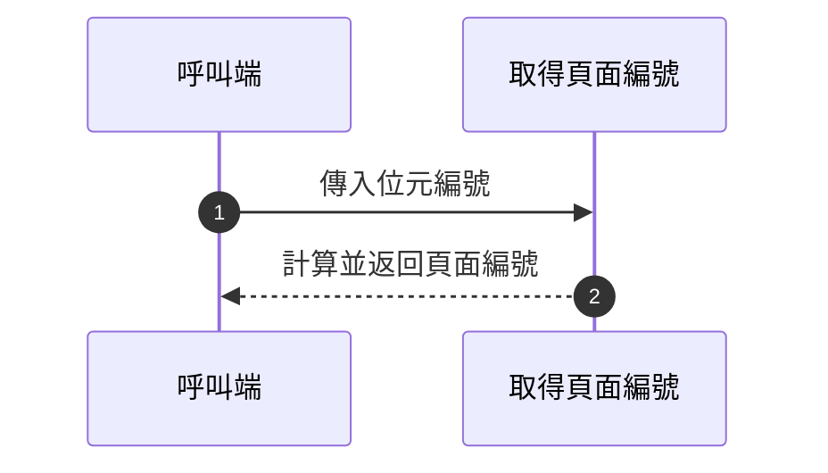
```mermaid
sequenceDiagram
    autoNumber
    participant 呼叫端
    participant 取得頁面編號
    呼叫端->>取得頁面編號: 傳入位元編號
    取得頁面編號-->>呼叫端: 計算並返回頁面編號
```

#### 程式邏輯

1. 接收一個非負整數的位元編號作為輸入參數。

2. 使用公式 

   ```
   Math.floor(位元編號 / #一頁可記錄的位元數)
   ```

    計算該位元元的頁面索引。

   - `位元編號`：欲操作的位元在整個位元陣列中的唯一標識。
   - `#一頁可記錄的位元數`：每頁可以存放的最大位元數，為類別的一個私有屬性。

3. 將結果作為回傳值返回呼叫者。

------

### `執行邏輯運算`

#### 功能概述

`執行邏輯運算` 是 `位元陣列` 類別的私有方法，用於在兩個位元陣列之間執行邏輯運算（如 AND、OR 和 XOR），並返回一個包含運算結果的新 `位元陣列`。它確保了位元陣列的長度相符後，逐位元進行計算，並處理結果分頁存儲。

------

#### 技術結構

1. 參考另一個 `位元陣列` 的資料進行逐頁邏輯運算
   - 通過`運算符`參數（`and`, `or`, `xor`）作為邏輯選擇器。
   - 使用位元操作 (如 `&`, `|`, `^`) 高效實現位元資料運算。
2. 結果為新建的位元陣列
   - 運算結果存儲到新生成的位元陣列中，避免影響原始資料。

------

#### 參數規格與回傳

##### 方法參數

| 參數名稱   | 類型       | 描述                                                         | 必要性 |
| ---------- | ---------- | ------------------------------------------------------------ | ------ |
| 另一個向量 | `位元陣列` | 欲進行邏輯運算的位元陣列，其位元數量必須與當前位元陣列一致。 | 是     |
| 運算符     | `string`   | 決定使用的邏輯運算類型。支援以下值<br />： `'and'`（邏輯且）、`'or'`（邏輯或）與 `'xor'`（邏輯異或）。 | 是     |

##### 回傳值

| 回傳值   | 類型       | 描述                                             |
| -------- | ---------- | ------------------------------------------------ |
| 運算結果 | `位元陣列` | 返回一個新的位元陣列，包含執行邏輯運算後的結果。 |

------

#### 循序圖

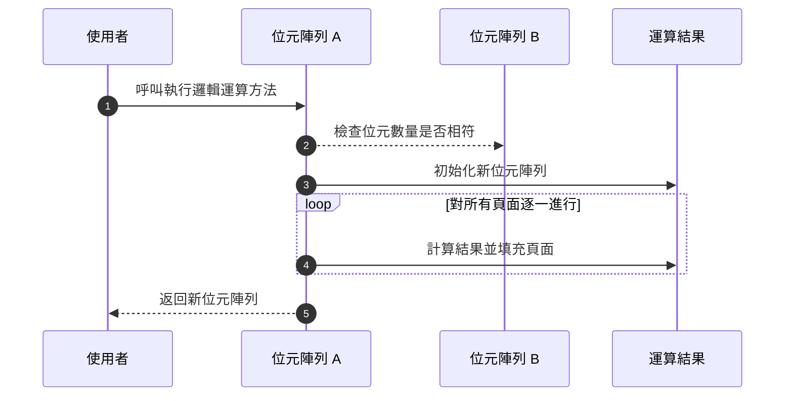
```mermaid
sequenceDiagram
    autoNumber
    participant 使用者 as 使用者
    participant 位元陣列1 as 位元陣列 A
    participant 位元陣列2 as 位元陣列 B
    participant 新位元陣列 as 運算結果

    使用者->>位元陣列1: 呼叫執行邏輯運算方法
    位元陣列1-->>位元陣列2: 檢查位元數量是否相符
    位元陣列1->>新位元陣列: 初始化新位元陣列
    loop 對所有頁面逐一進行
        位元陣列1->>新位元陣列: 計算結果並填充頁面
    end
    位元陣列1-->>使用者: 返回新位元陣列
```

------

#### 程式邏輯

1. **驗證參數有效性**：
   - 確保傳入的 `另一個向量` 是一個有效的 `位元陣列` 並且其長度與當前 `位元陣列` 相同。
   - 如果任一條件不符合，則拋出 `參數錯誤` 的例外。
2. **根據邏輯運算符選擇對應運算**：
   - 建立一個運算映射表來對應：
     - `and` 對應 `a & b`
     - `or` 對應 `a | b`
     - `xor` 對應 `a ^ b`
3. **初始化新位元陣列**：
   - 新位元陣列的長度與當前 `位元陣列` 相同。
4. **執行頁面級邏輯計算**：
   - 逐頁呼叫對應的邏輯運算符計算每頁資料，並將結果填入新位元陣列的 `#頁面` 陣列中。
5. **返回運算結果**：
   - 最終結果為新的 `位元陣列` 實例。

------

### `確保二進位字串只有0和1的字元`

#### 功能概述

此方法的主要功能是驗證一個給定的字串是否只包含合法的二進位元字元 (`0` 和 `1`)。
 如果字串中存在任何非 `0` 或 `1` 的字元，該方法將拋出一個 `二進位字串內容錯誤` 的例外。
 此方法用於確保二進位字串的格式正確，以避免後續處理時出現資料錯誤。

#### 技術結構

該方法屬於私有方法 (`#` 前綴) 並且內部使用迴圈遍歷輸入字串的每個字元進行檢查。
 觸發的例外為 `二進位字串內容錯誤`，必須在作業前正確捕捉錯誤來進一步處理。

#### 參數規格與回傳

| **參數名稱** | **類型** | **描述**               | **必要性** |
| ------------ | -------- | ---------------------- | ---------- |
| `字串`       | `string` | 欲進行檢查的二進位字串 | 必要       |

##### 回傳值：

| **回傳值** | **類型** | **描述**                               |
| ---------- | -------- | -------------------------------------- |
| 無         | 無       | 此方法不回傳值，若驗證失敗將拋出例外。 |

------

#### 循序圖

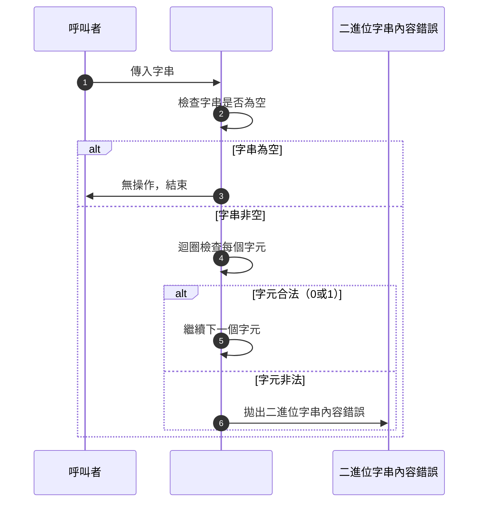
```mermaid
sequenceDiagram
    autoNumber
    participant 呼叫者 as 呼叫者
    participant 方法 as #確保二進位字串只有0和1的字元
    participant 例外 as 二進位字串內容錯誤
    呼叫者->>方法: 傳入字串
    方法->>方法: 檢查字串是否為空
    alt 字串為空
        方法->>呼叫者: 無操作，結束
    else 字串非空
        方法->>方法: 迴圈檢查每個字元
        alt 字元合法（0或1）
            方法->>方法: 繼續下一個字元
        else 字元非法
            方法->>例外: 拋出二進位字串內容錯誤
        end
    end
```

------

#### 程式邏輯

1. **初始化輸入字串檢查**
      若字串為空則無需處理，直接返回，方法結束。
2. **遍歷字串中的每個字元**
      使用迴圈檢查字串中的所有字元，是否為 `'0'` 或 `'1'`。
3. **拋出例外**
      若檢測到任一字元非合法的二進位元字元（即既非 `'0'` 也非 `'1'`），即刻拋出 `二進位字串內容錯誤` 例外，並附帶錯誤訊息。
4. **結束檢查**
      若所有字元均合法，則方法結束且不執行額外操作。

------

### `確定位元編號在範圍內`

#### 功能概述

`#確定位元編號在範圍內` 方法是一個私有方法，用於確保提供的位元編號為有效的數值，且位於合法範圍內。它主要用於內部驗證操作，以防止無效的位元編號導致程序邏輯出錯。

#### 技術結構

該方法首先檢查位元編號是否為數值類型，若不是則拋出 `型別錯誤`。接著，它驗證位元編號是否在合法範圍內 `[0, this.#數量 - 1]`，若範圍超出則拋出 `索引超出範圍錯誤`。

#### 參數規格與回傳

| **參數名稱** | **類型** | **描述**                                                   | **必要性** |
| ------------ | -------- | ---------------------------------------------------------- | ---------- |
| 位元編號     | `number` | 欲檢查的位元編號，必須是數值，範圍為 `[0, this.#數量 - 1]` | 是         |

| **回傳值** | **類型** | **描述**                                                     |
| ---------- | -------- | ------------------------------------------------------------ |
| 無         | 無       | 這是一個用於驗證的私有方法，不回傳任何值。若驗證失敗，會拋出錯誤。 |

#### 錯誤拋出

| **錯誤名稱**       | **描述**                                                     |
| ------------------ | ------------------------------------------------------------ |
| `型別錯誤`         | 當位元編號的類型不是數值時，拋出此錯誤。                     |
| `索引超出範圍錯誤` | 當位元編號超出合法範圍（即小於 0 或大於等於位元總數量）時拋出。 |

#### 循序圖

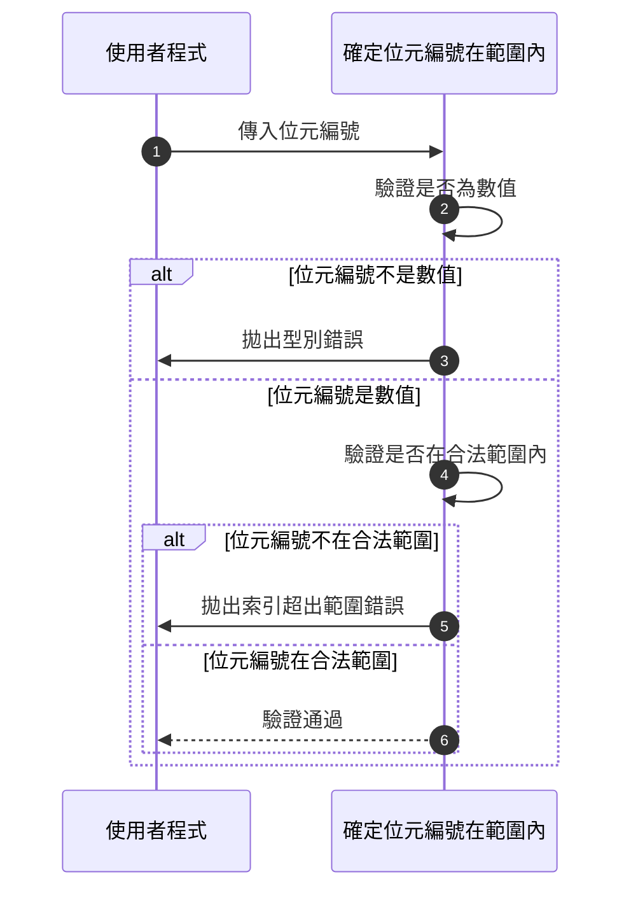
```mermaid
sequenceDiagram
    autoNumber
    participant 使用者程式
    participant 確定位元編號在範圍內
    使用者程式->>確定位元編號在範圍內: 傳入位元編號
    確定位元編號在範圍內->>確定位元編號在範圍內: 驗證是否為數值
    alt 位元編號不是數值
        確定位元編號在範圍內->>使用者程式: 拋出型別錯誤
    else 位元編號是數值
        確定位元編號在範圍內->>確定位元編號在範圍內: 驗證是否在合法範圍內
        alt 位元編號不在合法範圍
            確定位元編號在範圍內->>使用者程式: 拋出索引超出範圍錯誤
        else 位元編號在合法範圍
            確定位元編號在範圍內-->>使用者程式: 驗證通過
        end
    end
```

#### 程式邏輯

以下是 `#確定位元編號在範圍內` 方法的邏輯步驟描述：

1. **驗證類型**
       驗證參數 `位元編號` 是否為數值類型。
   - 若不是數值，拋出 `型別錯誤`，錯誤訊息為 `"位元編號必須是數值"`。
2. **檢查合法範圍**
       確保位元編號位於範圍 `[0, this.#數量 - 1]`。
   - 若位元編號小於 0 或大於等於 `this.#數量`，拋出 `索引超出範圍錯誤`，錯誤訊息為：

```
位元編號必須在(0, this.#數量 - 1)之間。
```

1. **成功通過驗證**
       若參數通過所有驗證，方法結束，返回至呼叫方。

------

### `計算需要的頁面數量`

#### 功能概述

`計算需要的頁面數量` 是一個私有方法，用於根據指定的位元數量，計算位元陣列存儲這些位元所需的頁面數量。頁面的劃分依據 `#一頁可記錄的位元數` 設定，支援處理大資料的位元分頁邏輯。

#### 技術結構

此方法使用數學公式計算頁面數量，保證計算結果向上取整數以容納所有位元數，即使未整除每頁容量的情況。核心公式如下：

```javascript
Math.floor((位元數量 + 每頁可紀錄位元數 - 1) / 每頁可紀錄位元數)
```

此公式核心邏輯是為了實現向上取整數，可有效避免浮點運算。

#### 參數規格與回傳

| 參數名稱 | 類型   | 描述                               | 必要性 |
| -------- | ------ | ---------------------------------- | ------ |
| 位元數量 | Number | 欲存儲的總位元數量，必須是非負整數 | 必要   |

**回傳值**

| 回傳值   | 類型   | 描述                                               |
| -------- | ------ | -------------------------------------------------- |
| 頁面數量 | Number | 計算的頁面總數，用以存儲指定的位元數量所需的頁面數 |

#### 循序圖

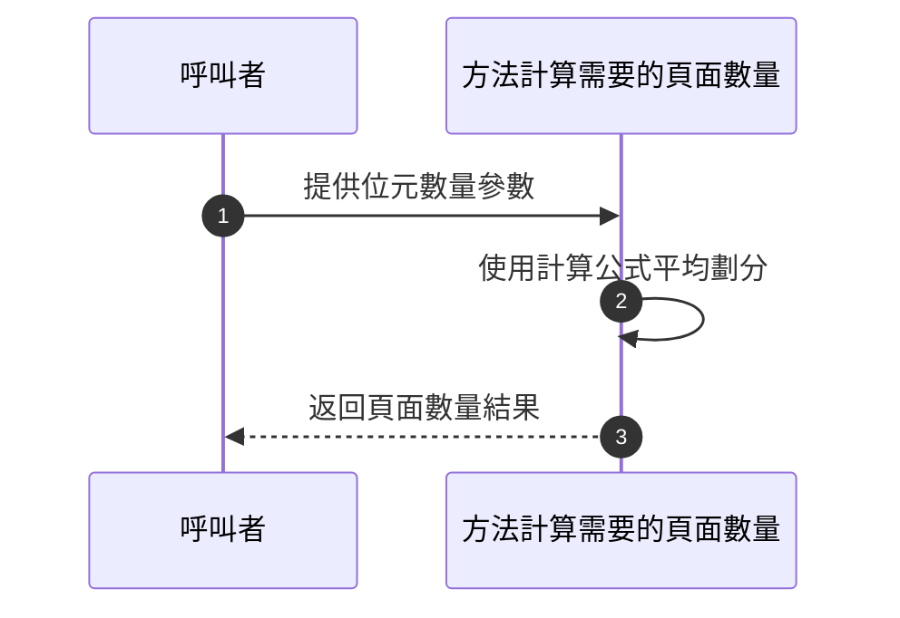
```mermaid
sequenceDiagram
    autoNumber
    participant 呼叫者
    participant 方法計算需要的頁面數量
    呼叫者->>方法計算需要的頁面數量: 提供位元數量參數
    方法計算需要的頁面數量->>方法計算需要的頁面數量: 使用計算公式平均劃分
    方法計算需要的頁面數量-->>呼叫者: 返回頁面數量結果
```

#### 程式邏輯

1. 接收一個參數 `位元數量`，其值表示要存儲的位元總數。
2. 讀取私有屬性 `#一頁可記錄的位元數`，作為內部分頁依據。
3. 使用公式計算所需的頁面數量：   
   - 公式：`Math.floor((位元數量 + this.#一頁可記錄的位元數 - 1) / this.#一頁可記錄的位元數)`。
   - 說明：     
     - 加上 `(每頁容量 - 1)` 可實現向上取整數效果。
     - 計算結果為頁數，確保餘數部分也能妥善分配到額外的頁面。
4. 返回計算的頁面總數。

------

### `設定位元數量`

#### 功能概述

`設定位元數量` 為位元陣列內部的私有方法，用來設定位元陣列的長度，並根據新的位元數量初始化頁面結構。此方法確保位元陣列能夠在長度變更後，重新初始化內部資料同時填充預設值（通常為 `0`）。

------

#### 技術結構

- 驗證傳入的位元數量是否合法（是否是非負數字）。
- 新的位元數量被計算出所需的分頁數量。
- 根據新位元數量，對內部頁面結構進行初始化，並填充為預設值 `0`。
- 更新總位元數量至新設定值，以匹配內部資料結構。

------

#### 參數規格與回傳

##### 參數

| 參數名稱 | 類型   | 描述                           | 是否必要 |
| -------- | ------ | ------------------------------ | -------- |
| 新數量   | Number | 新的位元數量，必須為非負整數。 | 必要     |

##### 回傳值

| 回傳值   | 類型   | 描述                                                         |
| -------- | ------ | ------------------------------------------------------------ |
| 無回傳值 | `void` | 該方法為內部設定函式，直接修改位元陣列的內部狀態無需回傳任何值。 |

------

#### 循序圖

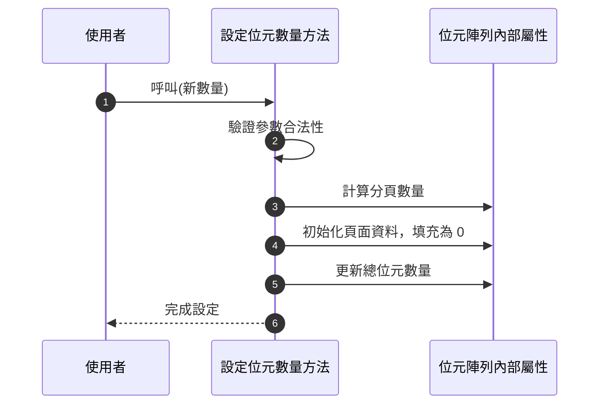
```mermaid
sequenceDiagram
    autoNumber
    participant 使用者
    participant 設定位元數量方法
    participant 位元陣列內部屬性
    使用者->>設定位元數量方法: 呼叫(新數量)
    設定位元數量方法->>設定位元數量方法: 驗證參數合法性
    設定位元數量方法->>位元陣列內部屬性: 計算分頁數量
    設定位元數量方法->>位元陣列內部屬性: 初始化頁面資料，填充為 0
    設定位元數量方法->>位元陣列內部屬性: 更新總位元數量
    設定位元數量方法-->>使用者: 完成設定
```

------

#### 程式邏輯

1. 確認輸入的參數 `新數量` 是否為非負整數：
   - 若非數字或小於0，則拋出型別錯誤。
2. 根據新的位元數量計算所需頁面的數量：
   - 使用公式計算每頁所需的分頁。
3. 根據計算結果初始化頁面結構：
   - 設置新分頁數量，並將所有分頁的值預設為 `0`。
4. 更新內部的位元總數。
