# 向量

[toc]

## 類別概述

### 類別圖
以下為 `向量` 類別的 UML 類別圖，此類別是 `Array` 的擴展，並新增了一系列針對向量操作的功能。

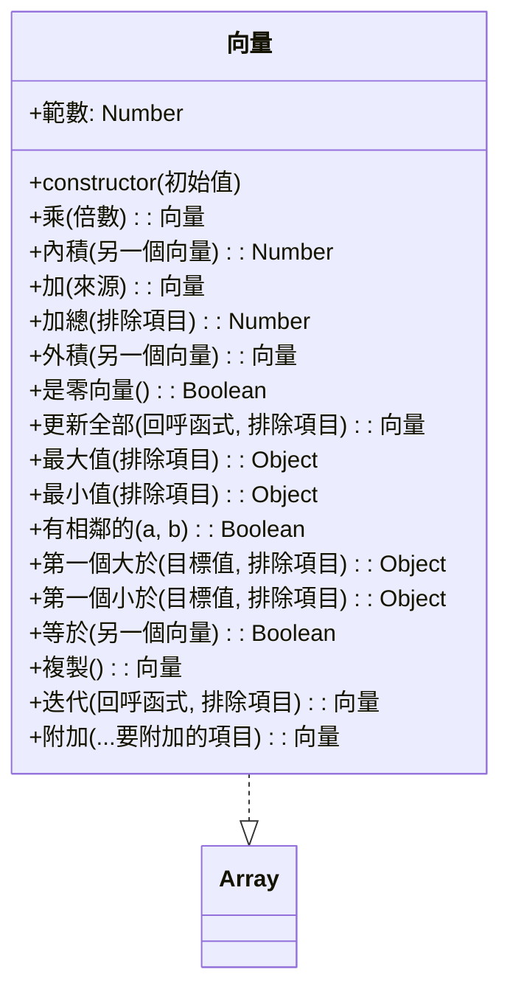
```mermaid
classDiagram
    class 向量 {
        +constructor(初始值)
        +範數: Number
        +乘(倍數): 向量
        +內積(另一個向量): Number
        +加(來源): 向量
        +加總(排除項目): Number
        +外積(另一個向量): 向量
        +是零向量(): Boolean
        +更新全部(回呼函式, 排除項目): 向量
        +最大值(排除項目): Object
        +最小值(排除項目): Object
        +有相鄰的(a, b): Boolean
        +第一個大於(目標值, 排除項目): Object
        +第一個小於(目標值, 排除項目): Object
        +等於(另一個向量): Boolean
        +複製(): 向量
        +迭代(回呼函式, 排除項目): 向量
        +附加(...要附加的項目): 向量
    }
    向量 ..|> Array
```

---

## Public Methods 說明

### 向量 (constructor)
#### 功能概述
建立一個新的向量實例，初始化內部的元素資料。

#### 技術結構
初始化向量時接收一個數字陣列，並將其設置為內部資料結構。

#### 參數規格與回傳

| 參數名稱 | 類型            | 描述                                       | 必要性 |
| -------- | --------------- | ------------------------------------------ | ------ |
| 初始資料 | Array\<Number\> | 初始化向量的數字陣列，代表該向量的所有元素 | 是     |

| 回傳值 | 類型 | 描述                     |
| ------ | ---- | ------------------------ |
| 無     | 無   | 此方法無返回值，僅初始化 |

#### 參數規範與行為
1. 若 `初始資料` 為空陣列，則初始化為一個空向量。
2. 若 `初始資料` 包含非數字的元素，則拋出例外。

---

#### 循序圖
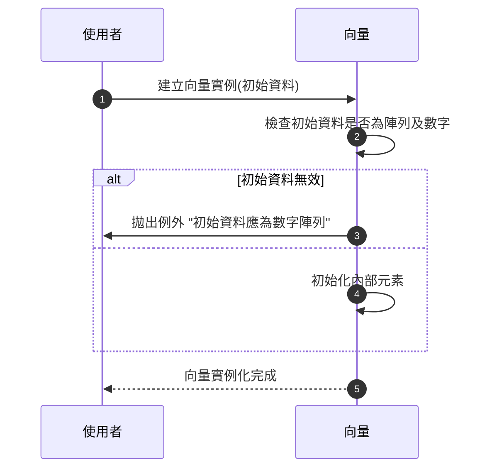
```mermaid
sequenceDiagram
    autoNumber
    participant 使用者
    participant 向量
    使用者->>向量: 建立向量實例(初始資料)
    向量->>向量: 檢查初始資料是否為陣列及數字
    alt 初始資料無效
        向量->>使用者: 拋出例外 "初始資料應為數字陣列"
    else
        向量->>向量: 初始化內部元素
    end
    向量-->>使用者: 向量實例化完成
```

#### 程式邏輯
1. 接收 `初始資料` 並檢查：
   - 是否為陣列；
   - 是否每個值均為有效的數字。
2. 若檢查未通過，拋出例外 `"初始資料應為數字陣列"`。
3. 若檢查通過，將 `初始資料` 賦值為內部存取資料。
4. 初始化完成，返回向量實例。

---

#### 使用範例

**Case 1: 建立一個有效向量實例**
```javascript
const vector = new Vector([1, 2, 3, 4]);
console.log(vector); // 向量包含元素 [1, 2, 3, 4]
```

**Case 2: 建立空向量**
```javascript
const emptyVector = new Vector([]);
console.log(emptyVector); // 空向量，無元素
```

**Case 3: 嘗試使用無效資料**
```javascript
try {
    const invalidVector = new Vector([1, "a", 3]); // 包含非數字 "a"
} catch (error) {
    console.error(error.message); // 初始資料應為數字陣列
}
```

---

#### 錯誤處理
1. **類型錯誤**
   - 初始資料非陣列時（如傳入一個物件或字串）：
     - 拋出例外 `"初始資料應為數字陣列"`。

2. **元素錯誤**
   - 初始資料為陣列，但內有非數字的元素：
     - 拋出例外 `"初始資料應為數字陣列"`。

3. **空陣列**
   - 若初始資料為空陣列，則初始化為空向量，無拋例外。

---

### 範數

#### 功能概述
此方法返回向量的範數（歐幾里得長度），計算公式為：

`範數 = sqrt(Σ(xi^2))`，其中 `xi` 為向量中的每個元素。

#### 技術結構
此屬性為 `getter`，自動基於向量元素計算範數，採用數學方法進行累加計算平方和。

#### 參數規格與回傳

| 參數名稱 | 類型 | 描述   | 必要性 |
| -------- | ---- | ------ | ------ |
| 無       | 無   | 無參數 | 無     |

| 回傳值 | 類型   | 描述                             |
| ------ | ------ | -------------------------------- |
| 範數   | Number | 計算出的向量範數（歐幾里得長度） |

#### 循序圖
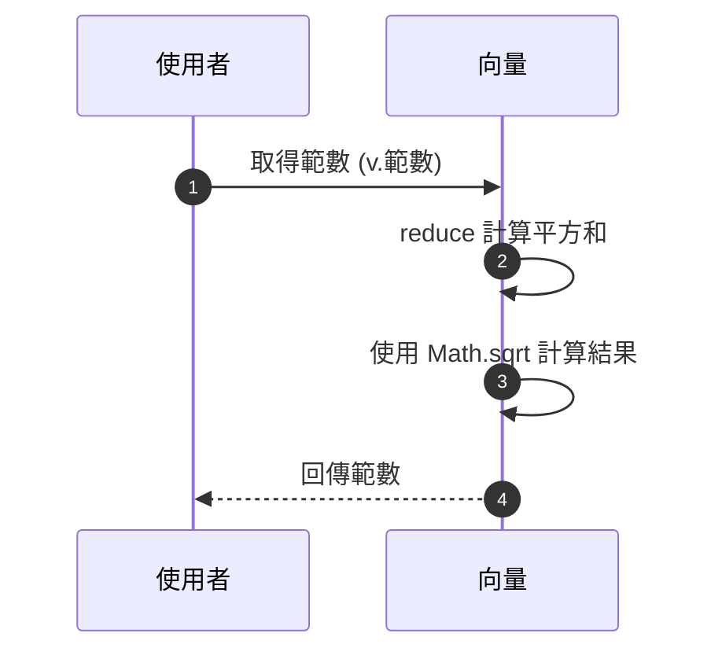
```mermaid
sequenceDiagram
    autoNumber
    participant 使用者
    participant 向量
    使用者->>向量: 取得範數 (v.範數)
    向量->>向量: reduce 計算平方和
    向量->>向量: 使用 Math.sqrt 計算結果
    向量-->>使用者: 回傳範數
```

#### 程式邏輯
1. 對向量中的元素進行循環，依次計算平方。
2. 使用 `reduce` 計算所有平方加總。
3. 利用 `Math.sqrt` 計算總和的平方根。
4. 回傳計算結果。

---

### 加

#### 功能概述
向量相加，可與純量或另一個向量進行加法運算。若操作對象為向量，兩者必須具有相同的長度。

#### 技術結構
方法判別是否為純量加法或是向量加法。向量加法中，檢查兩向量的維度是否一致，並依次相加。

#### 參數規格與回傳

| 參數名稱 | 類型           | 描述                             | 必要性 |
| -------- | -------------- | -------------------------------- | ------ |
| 來源     | Number \| 向量 | 加法操作的對象，可以是純量或向量 | 是     |

| 回傳值 | 類型 | 描述             |
| ------ | ---- | ---------------- |
| 回傳值 | 向量 | 計算後的向量對象 |

#### 循序圖
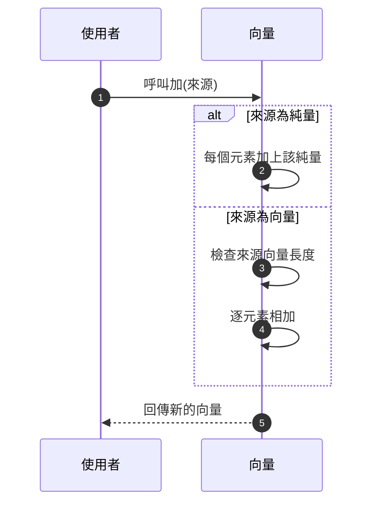
```mermaid
sequenceDiagram
    autoNumber
    participant 使用者
    participant 向量
    使用者->>向量: 呼叫加(來源)
    alt 來源為純量
        向量->>向量: 每個元素加上該純量
    else 來源為向量
        向量->>向量: 檢查來源向量長度
        向量->>向量: 逐元素相加
    end
    向量-->>使用者: 回傳新的向量
```

#### 程式邏輯
1. 若來源為純量，直接對所有元素加上來源值。
2. 若來源為向量，先進行長度比對，不一致拋出異常。
3. 若長度一致，依據索引逐元素加法。
4. 返回新的向量實例。

---

### 乘
#### 功能概述
此方法將向量的每個元素乘以指定倍數，並返回新的向量。

#### 技術結構
內部使用 `map` 方法對向量中的每個值進行倍數運算，並將結果存入新的 `向量` 實例。

#### 參數規格與回傳

| 參數名稱 | 類型   | 描述                     | 必要性 |
| -------- | ------ | ------------------------ | ------ |
| 倍數     | Number | 乘法倍數，應為有效的數字 | 是     |

| 回傳值 | 類型 | 描述               |
| ------ | ---- | ------------------ |
| 新向量 | 向量 | 返回相乘後的新向量 |

#### 循序圖
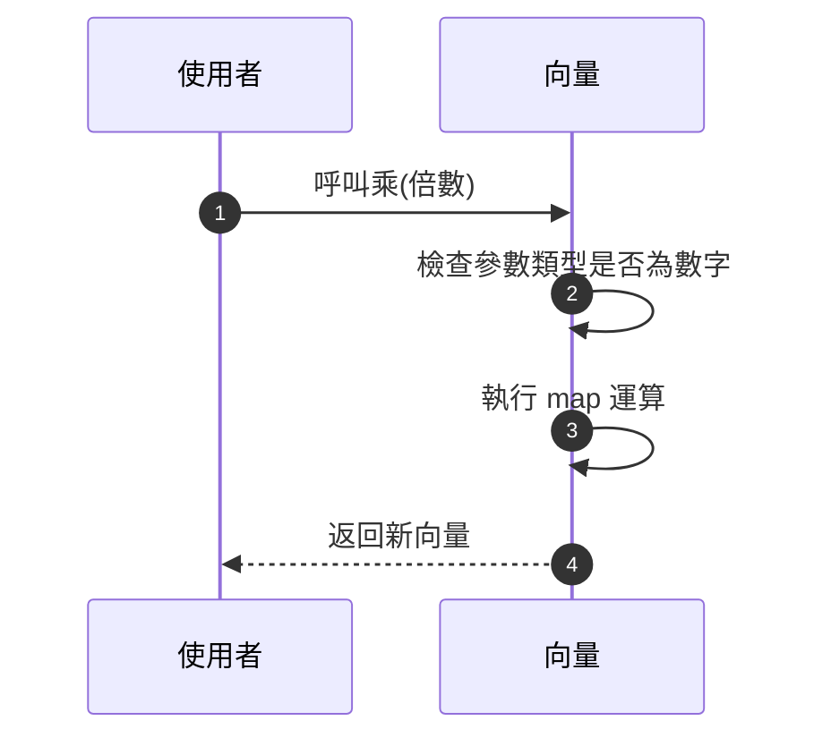
```mermaid
sequenceDiagram
    autoNumber
    participant 使用者
    participant 向量
    使用者->>向量: 呼叫乘(倍數)
    向量->>向量: 檢查參數類型是否為數字
    向量->>向量: 執行 map 運算
    向量-->>使用者: 返回新向量
```

#### 程式邏輯
1. 檢查傳入的倍數是否為數字，否則拋出 `型別錯誤`。
2. 使用 `map` 函數遍歷向量，對每個元素乘以倍數。
3. 返回新的向量實例。

---

### 交換
#### 功能概述
交換向量中兩個指定索引下的元素。

#### 技術結構
使用臨時變數，將兩個索引對應的元素進行交換。

#### 參數規格與回傳

| 參數名稱 | 類型   | 描述                           | 必要性 |
| -------- | ------ | ------------------------------ | ------ |
| a        | Number | 第一個索引，應在向量索引範圍內 | 是     |
| b        | Number | 第二個索引，應在向量索引範圍內 | 是     |

| 回傳值   | 類型 | 描述                   |
| -------- | ---- | ---------------------- |
| 當前向量 | 向量 | 返回被交換後的向量自身 |

#### 循序圖
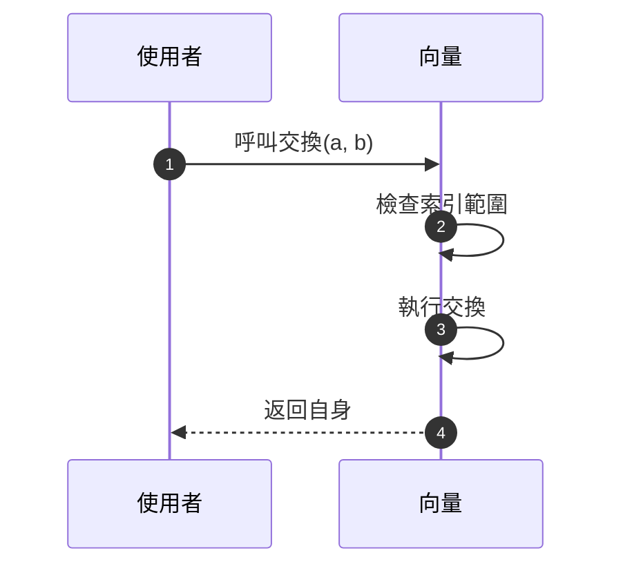
```mermaid
sequenceDiagram
    autoNumber
    participant 使用者
    participant 向量
    使用者->>向量: 呼叫交換(a, b)
    向量->>向量: 檢查索引範圍
    向量->>向量: 執行交換
    向量-->>使用者: 返回自身
```

#### 程式邏輯
1. 檢查兩個索引是否在範圍內，否則拋出錯誤。
2. 使用臨時變數存儲索引 `a` 的值，並將索引 `b` 的值賦予索引 `a`。
3. 將臨時變數的值賦給索引 `b`。
4. 返回向量自身。

---

### 內積
#### 功能概述
計算兩向量的內積。

#### 技術結構
採用公式計算內積 `Σ(xi*yi)`，其中 `xi` 和 `yi` 分別為兩向量對應位置的元素。

#### 參數規格與回傳

| 參數名稱   | 類型 | 描述               | 必要性 |
| ---------- | ---- | ------------------ | ------ |
| 另一個向量 | 向量 | 計算內積的比較對象 | 是     |

| 回傳值 | 類型   | 描述               |
| ------ | ------ | ------------------ |
| 內積   | Number | 內積的數值計算結果 |

#### 循序圖
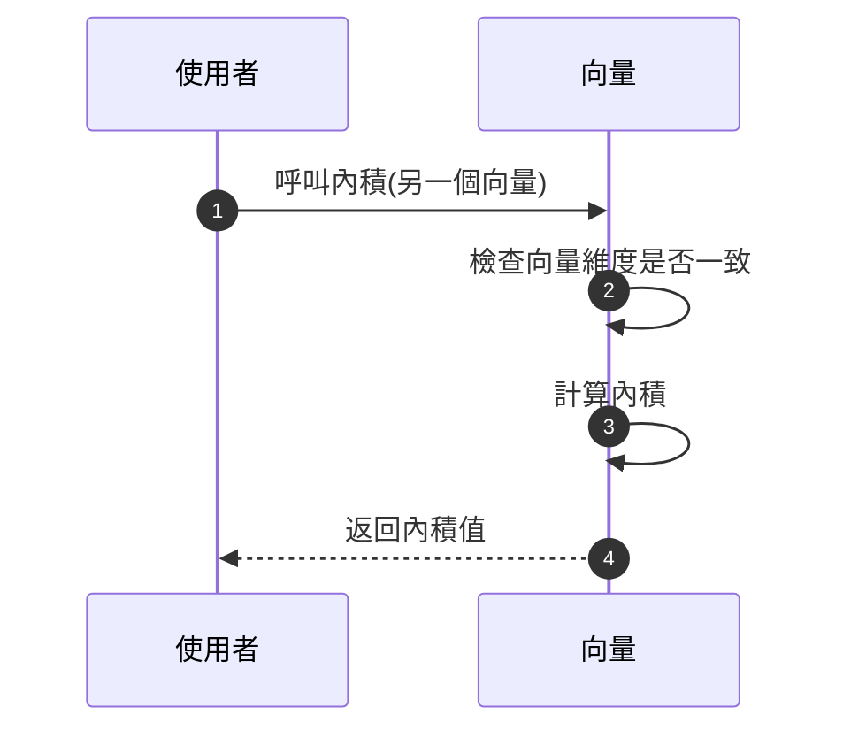
```mermaid
sequenceDiagram
    autoNumber
    participant 使用者
    participant 向量
    使用者->>向量: 呼叫內積(另一個向量)
    向量->>向量: 檢查向量維度是否一致
    向量->>向量: 計算內積
    向量-->>使用者: 返回內積值
```

#### 程式邏輯
1. 檢查傳入向量的長度是否與當前向量一致，否則拋出 `參數錯誤`。
2. 遍歷兩向量對應位置的元素，計算乘積並累加。
3. 返回內積值。

---

### 外積
#### 功能概述
計算兩個三維向量的外積，返回結果向量。

#### 技術結構
公式：向量1 (x1, y1, z1) 外積 向量2 (x2, y2, z2) = `(y1*z2 - z1*y2, z1*x2 - x1*z2, x1*y2 - y1*x2)`。

#### 參數規格與回傳

| 參數名稱   | 類型 | 描述                     | 必要性 |
| ---------- | ---- | ------------------------ | ------ |
| 另一個向量 | 向量 | 要進行外積運算的三維向量 | 是     |

| 回傳值   | 類型 | 描述               |
| -------- | ---- | ------------------ |
| 外積向量 | 向量 | 計算外積後的新向量 |

#### 循序圖
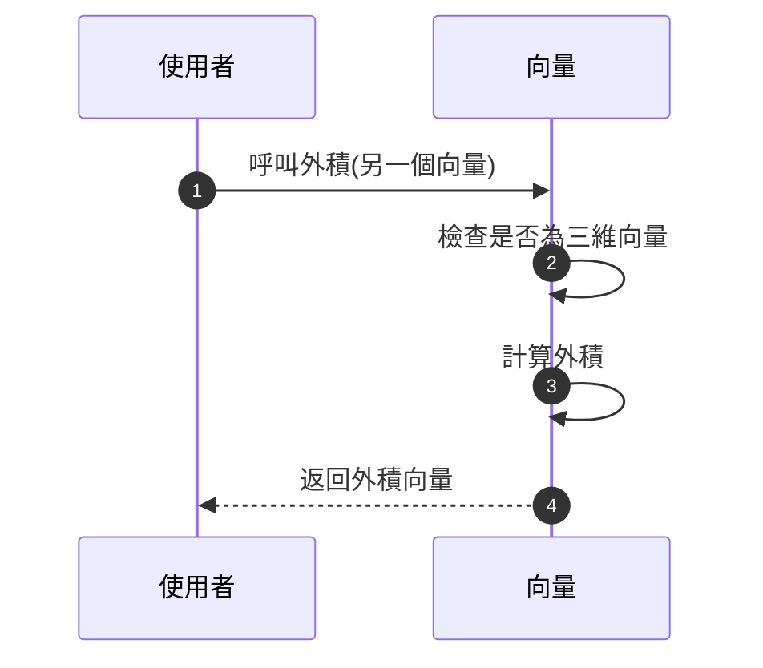
```mermaid
sequenceDiagram
    autoNumber
    participant 使用者
    participant 向量
    使用者->>向量: 呼叫外積(另一個向量)
    向量->>向量: 檢查是否為三維向量
    向量->>向量: 計算外積
    向量-->>使用者: 返回外積向量
```

#### 程式邏輯
1. 檢查兩向量是否為三維向量。
2. 按照外積公式計算各軸的值。
3. 返回一個新的向量實例，其中包含外積結果。

---

### 附加
#### 功能概述
將指定元素附加到向量的末尾，返回新的向量。

#### 技術結構
展開所有傳入參數，並使用 `push` 將其添加到新向量中。

#### 參數規格與回傳

| 參數名稱     | 類型  | 描述                 | 必要性 |
| ------------ | ----- | -------------------- | ------ |
| 要附加的項目 | Array | 向量中需要新增的元素 | 否     |

| 回傳值 | 類型 | 描述               |
| ------ | ---- | ------------------ |
| 新向量 | 向量 | 附加後返回的新向量 |

#### 循序圖
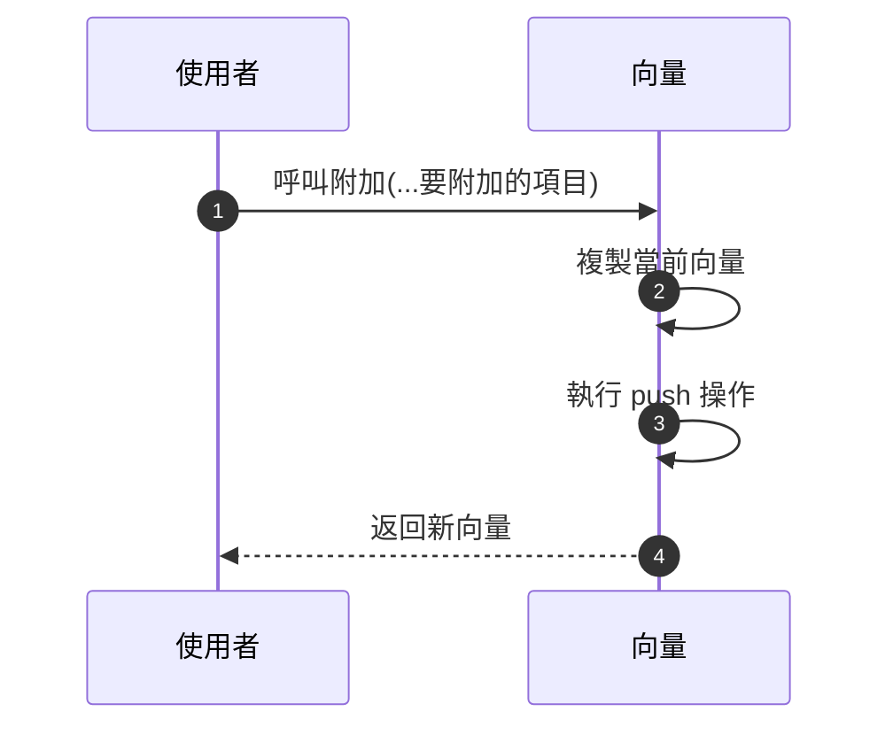
```mermaid
sequenceDiagram
    autoNumber
    participant 使用者
    participant 向量
    使用者->>向量: 呼叫附加(...要附加的項目)
    向量->>向量: 複製當前向量
    向量->>向量: 執行 push 操作
    向量-->>使用者: 返回新向量
```

#### 程式邏輯
1. 將當前向量複製為新的 `向量`。
2. 遍歷傳入的參數並展開所有元素。
3. 利用向量的 `push` 方法，將新數值添加到末尾。
4. 返回新向量。

---

### 加總
#### 功能概述
計算向量中所有元素的總和，並可選擇性排除特定項目。

#### 技術結構
遍歷向量元素，若有傳入 `排除項目`，則跳過在排除列表裡的索引。

#### 參數規格與回傳

| 參數名稱 | 類型           | 描述                                   | 必要性 |
| -------- | -------------- | -------------------------------------- | ------ |
| 排除項目 | 位元陣列\|null | 排除索引的集合，如果為 `null` 則不排除 | 否     |

| 回傳值 | 類型   | 描述               |
| ------ | ------ | ------------------ |
| 總和值 | Number | 返回元素加總的結果 |

#### 循序圖
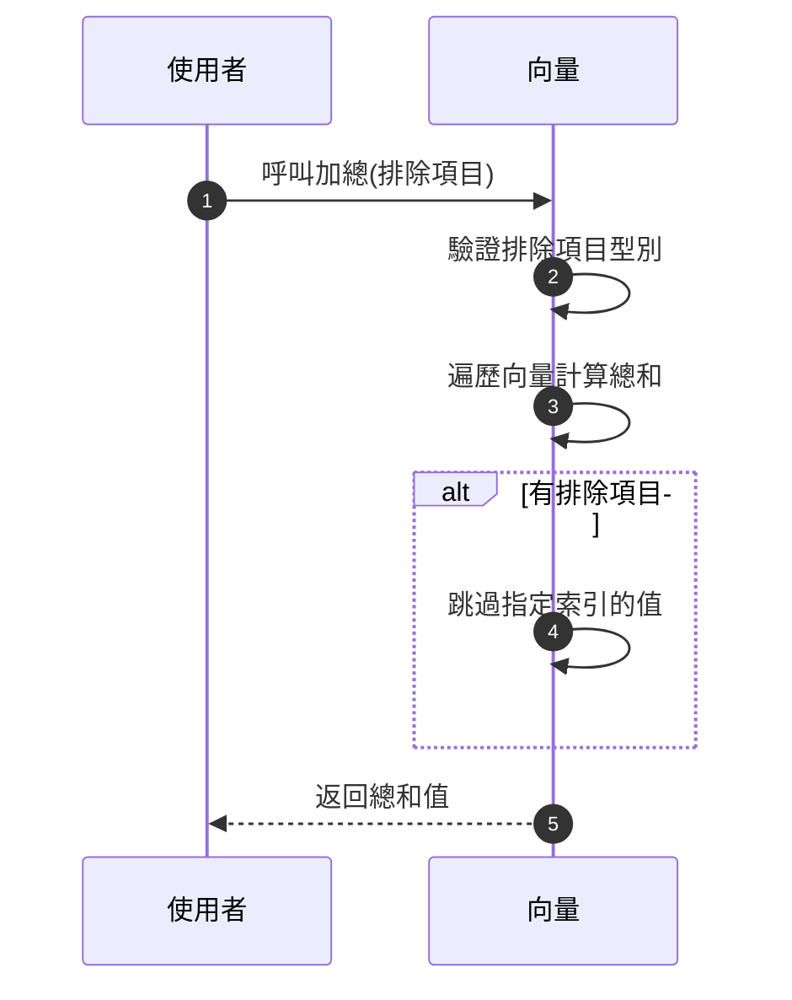
```mermaid
sequenceDiagram
    autoNumber
    participant 使用者
    participant 向量
    使用者->>向量: 呼叫加總(排除項目)
    向量->>向量: 驗證排除項目型別
    向量->>向量: 遍歷向量計算總和
    alt 有排除項目
        向量->>向量: 跳過指定索引的值
    end
    向量-->>使用者: 返回總和值
```

#### 程式邏輯
1. 驗證 `排除項目` 的型別是否為 `位元陣列` 或 `null`。
2. 遍歷向量中的每個元素，若索引在 `排除項目` 中則跳過該元素。
3. 計算剩下元素的總和並返回。

---

### 是零向量
#### 功能概述
判斷向量是否所有元素皆為零。

#### 技術結構
使用 `every` 方法檢查每個元素是否等於零。

#### 參數規格與回傳

| 參數名稱 | 類型 | 描述   | 必要性 |
| -------- | ---- | ------ | ------ |
| 無       | 無   | 無參數 | 無     |

| 回傳值 | 類型    | 描述                                          |
| ------ | ------- | --------------------------------------------- |
| 布林值 | Boolean | 若所有元素為零則返回 `true`，否則返回 `false` |

#### 循序圖
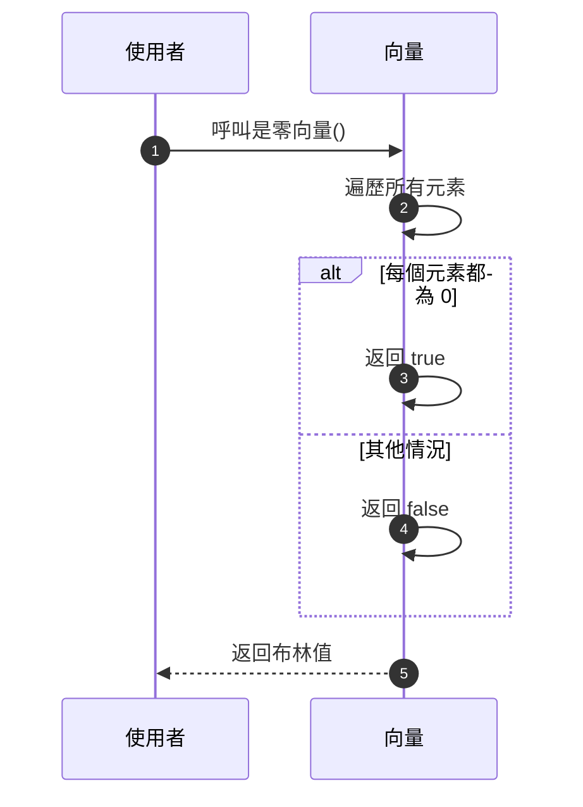
```mermaid
sequenceDiagram
    autoNumber
    participant 使用者
    participant 向量
    使用者->>向量: 呼叫是零向量()
    向量->>向量: 遍歷所有元素
    alt 每個元素都為 0
        向量->>向量: 返回 true
    else 其他情況
        向量->>向量: 返回 false
    end
    向量-->>使用者: 返回布林值
```

#### 程式邏輯
1. 使用 `every` 檢查向量中的每個值是否等於零。
2. 返回檢查結果：若全為零則返回 `true`。

---

### 最大值
#### 功能概述
尋找向量中最大的值，並可排除特定索引的元素。

#### 技術結構
利用私有方法 `#尋找最後一個符合條件的項目`，並提供條件函數判斷是否為最大值。

#### 參數規格與回傳

| 參數名稱 | 類型           | 描述                                   | 必要性 |
| -------- | -------------- | -------------------------------------- | ------ |
| 排除項目 | 位元陣列\|null | 排除索引的集合，如果為 `null` 則不排除 | 否     |

| 回傳值           | 類型   | 描述                 |
| ---------------- | ------ | -------------------- |
| 找到的最大值物件 | Object | 包含最大值的索引與值 |

#### 循序圖

```mermaid
sequenceDiagram
    autoNumber
    participant 使用者
    participant 向量
    使用者->>向量: 呼叫最大值(排除項目)
    向量->>向量: 呼叫 #尋找最後一個符合條件的項目
    向量-->>使用者: 返回最大值的索引和值
```

#### 程式邏輯
1. 定義條件函數：當前元素是否大於已知的最大項目。
2. 調用私有方法 `#尋找最後一個符合條件的項目`。
3. 返回匹配結果的索引及值。

---

### 最小值
#### 功能概述
尋找向量中最小的值，並可排除特定索引的元素。

#### 技術結構
利用私有方法 `#尋找最後一個符合條件的項目`，並提供條件函數判斷是否為最小值。

#### 參數規格與回傳

| 參數名稱 | 類型           | 描述                                   | 必要性 |
| -------- | -------------- | -------------------------------------- | ------ |
| 排除項目 | 位元陣列\|null | 排除索引的集合，如果為 `null` 則不排除 | 否     |

| 回傳值           | 類型   | 描述                 |
| ---------------- | ------ | -------------------- |
| 找到的最小值物件 | Object | 包含最小值的索引與值 |

#### 循序圖
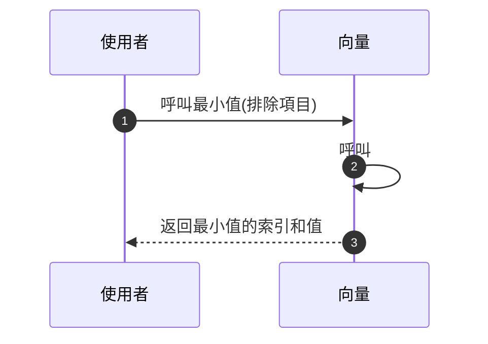
```mermaid
sequenceDiagram
    autoNumber
    participant 使用者
    participant 向量
    使用者->>向量: 呼叫最小值(排除項目)
    向量->>向量: 呼叫 #尋找最後一個符合條件的項目
    向量-->>使用者: 返回最小值的索引和值
```

#### 程式邏輯
1. 定義條件函數：當前元素是否小於已知的最小項目。
2. 調用私有方法 `#尋找最後一個符合條件的項目`。
3. 返回匹配結果的索引及值。

---

### 等於
#### 功能概述
比較當前向量與另一個向量是否相等。

#### 技術結構
逐元素比較兩向量的大小，並確保長度一致。

#### 參數規格與回傳

| 參數名稱   | 類型       | 描述         | 必要性 |
| ---------- | ---------- | ------------ | ------ |
| 另一個向量 | 向量\|陣列 | 要比較的對象 | 是     |

| 回傳值 | 類型    | 描述                                      |
| ------ | ------- | ----------------------------------------- |
| 布林值 | Boolean | 若向量相等則返回 `true`，否則返回 `false` |

#### 循序圖
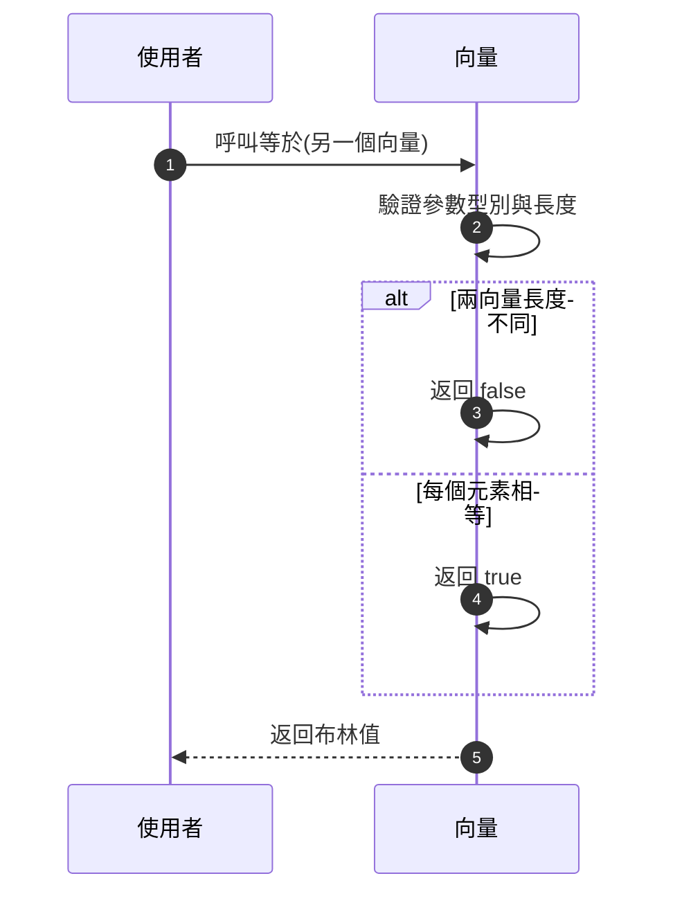
```mermaid
sequenceDiagram
    autoNumber
    participant 使用者
    participant 向量
    使用者->>向量: 呼叫等於(另一個向量)
    向量->>向量: 驗證參數型別與長度
    alt 兩向量長度不同
        向量->>向量: 返回 false
    else 每個元素相等
        向量->>向量: 返回 true
    end
    向量-->>使用者: 返回布林值
```

#### 程式邏輯
1. 驗證另一個向量是否為 `向量` 或 `陣列`。
2. 若長度不同，直接返回 `false`。
3. 使用 `every` 比較兩向量的每個元素。
4. 返回比較結果。

---

## Private Methods 說明

### 尋找最後一個符合條件的項目
#### 功能概述
從向量中尋找最符合特定條件的最後一個項目，並返回其索引與值。

#### 技術結構
該方法為私有方法，執行條件檢查與迭代，確保結果為最後一個匹配項目。

#### 參數規格與回傳

| 參數名稱 | 類型           | 描述                                   | 必要性 |
| -------- | -------------- | -------------------------------------- | ------ |
| 條件     | Function       | 匹配條件函數                           | 是     |
| 排除項目 | 位元陣列\|null | 設定排除的索引集合，若為空則不排除元素 | 否     |

| 回傳值   | 類型   | 描述               |
| -------- | ------ | ------------------ |
| 回傳結果 | Object | 匹配結果的索引與值 |

#### 循序圖
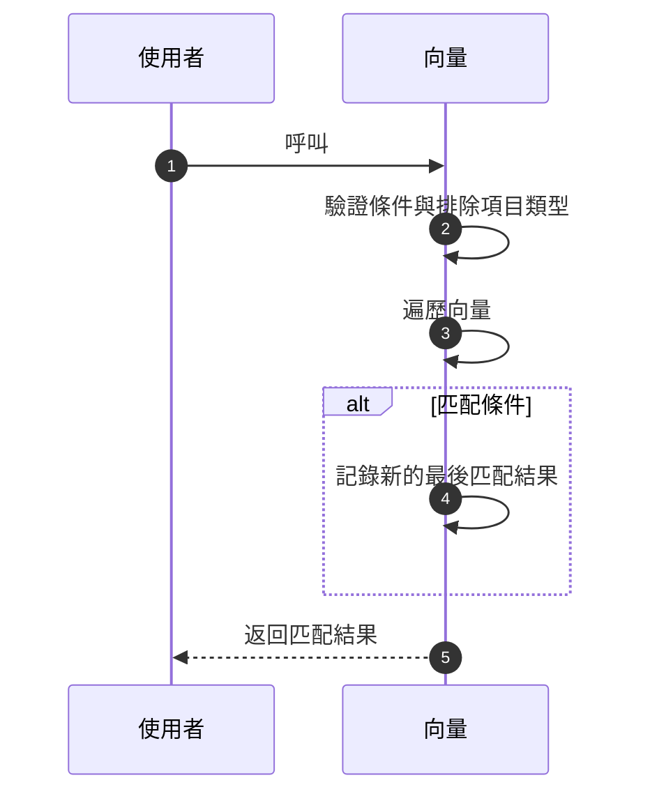
```mermaid
sequenceDiagram
    autoNumber
    participant 使用者
    participant 向量
    使用者->>向量: 呼叫 #尋找最後一個符合條件的項目
    向量->>向量: 驗證條件與排除項目類型
    向量->>向量: 遍歷向量
    alt 匹配條件
        向量->>向量: 記錄新的最後匹配結果
    end
    向量-->>使用者: 返回匹配結果
```

#### 程式邏輯
1. 初始化結果物件，索引設為 -1。
2. 驗證條件函數與排除項目類型。
3. 遍歷向量，按條件匹配，記錄最後的匹配結果。
4. 返回匹配索引與值。

---

### #檢查向量維度相同
#### 功能概述
檢查兩向量的維度是否一致。

#### 技術結構
比較當前向量與傳入參數的長度是否相等。

#### 參數規格與回傳

| 參數名稱 | 類型 | 描述                 | 必要性 |
| -------- | ---- | -------------------- | ------ |
| 向量來源 | 向量 | 要進行檢查的目標向量 | 是     |

| 回傳值 | 類型 | 描述               |
| ------ | ---- | ------------------ |
| 無     | 無   | 不返回值，僅做檢查 |

#### 循序圖
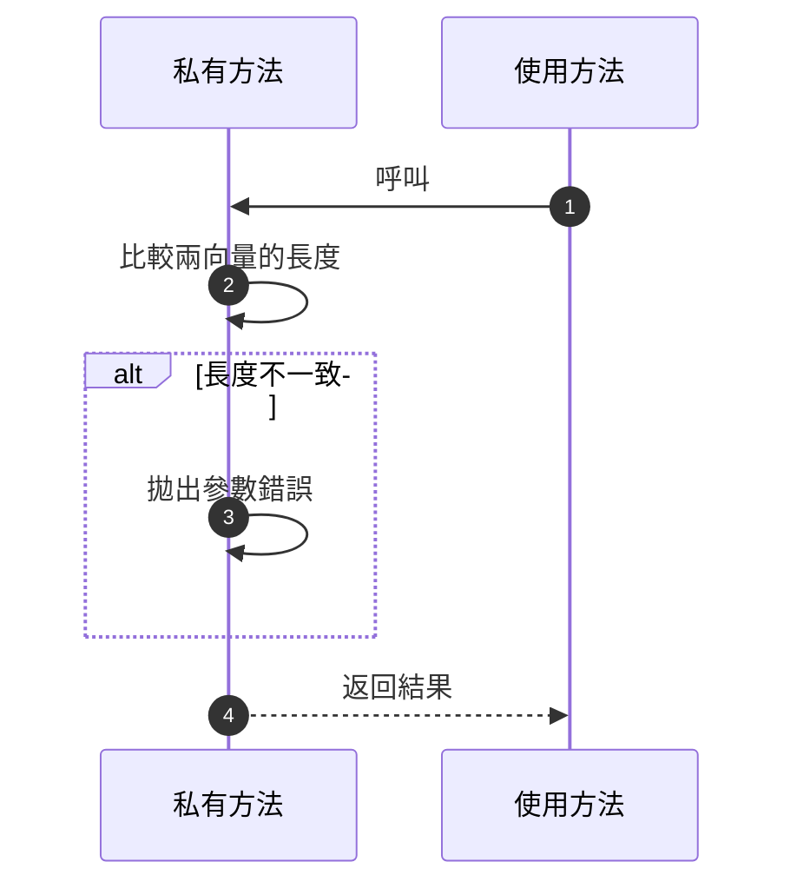
```mermaid
sequenceDiagram
    autoNumber
    participant 私有方法
    participant 使用方法
    使用方法->>私有方法: 呼叫 #檢查向量維度相同(來源)
    私有方法->>私有方法: 比較兩向量的長度
    alt 長度不一致
        私有方法->>私有方法: 拋出參數錯誤
    end
    私有方法-->>使用方法: 返回結果
```

#### 程式邏輯
1. 比較當前向量的長度與目標向量長度是否一致。
2. 若一致則返回，否則拋出異常。

---

### #檢查三維向量
#### 功能概述
檢查向量是否為三維向量。

#### 技術結構
驗證向量長度是否等於 3。

#### 參數規格與回傳

| 參數名稱 | 類型 | 描述                 | 必要性 |
| -------- | ---- | -------------------- | ------ |
| 向量檢查 | 向量 | 要進行檢查的目標向量 | 是     |

| 回傳值 | 類型 | 描述               |
| ------ | ---- | ------------------ |
| 無     | 無   | 不返回值，僅做檢查 |

#### 循序圖
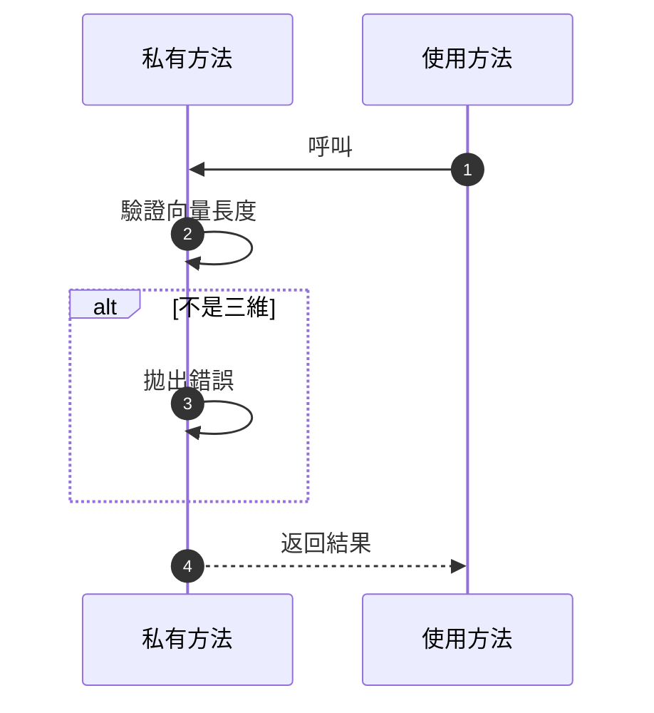
```mermaid
sequenceDiagram
    autoNumber
    participant 私有方法
    participant 使用方法
    使用方法->>私有方法: 呼叫 #檢查三維向量
    私有方法->>私有方法: 驗證向量長度
    alt 不是三維
        私有方法->>私有方法: 拋出錯誤
    end
    私有方法-->>使用方法: 返回結果
```

#### 程式邏輯
1. 確保目標向量為陣列且長度等於 3。
2. 若不符合要求拋出錯誤。

------

### #提出排除項目型別必須是位元陣列
#### 功能概述
檢查 `排除項目` 的參數型別是否正確（應為 `位元陣列` 或 `null`）。

#### 技術結構
此方法內部拋出型別相關的錯誤，確保方法參數格式有效。

#### 參數規格與回傳

| 參數名稱 | 類型           | 描述         | 必要性 |
| -------- | -------------- | ------------ | ------ |
| 排除項目 | 位元陣列\|null | 被檢查的參數 | 是     |

| 回傳值 | 類型 | 描述               |
| ------ | ---- | ------------------ |
| 無     | 無   | 不返回值，僅做檢查 |

#### 程式邏輯
1. 檢查 `排除項目` 是否為 `null` 或 `位元陣列` 實例。
2. 如果類型不正確，拋出型別錯誤。

---

### #尋找最後一個符合條件的項目
#### 功能概述
根據給定條件函數，檢索向量中最後一個符合條件的項目。

#### 技術結構
遍歷向量，找到最後一個符合條件的元素及其索引。

#### 參數規格與回傳

| 參數名稱 | 類型     | 描述                     | 必要性 |
| -------- | -------- | ------------------------ | ------ |
| 條件函數 | Function | 檢查每個元素是否符合條件 | 是     |

| 回傳值 | 類型   | 描述                       |
| ------ | ------ | -------------------------- |
| 結果   | Object | 包含符合條件的索引與值物件 |

#### 程式邏輯
1. 遍歷向量的每個元素。
2. 使用條件函數逐一檢查是否符合條件。
3. 傳回最後一個符合條件值的索引與值。

---
