# 日期工具

[toc]

---

## 類別概述

類別 `日期工具` 是一個用於操作和格式化日期的高級工具集合，提供了多種實用方法包括加減日期、格式化、檢查日期是否有效，以及在指定範圍內進行日期比較等。

### 類別圖

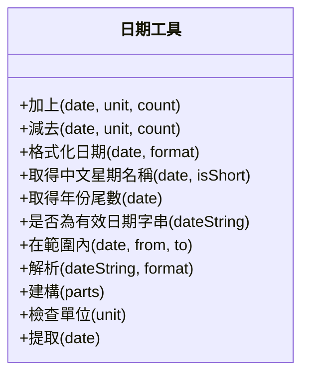

---

## Public Methods 說明

### 加上

#### 功能概述

將指定的時間單位 (如年、月、日等) 加到指定的日期中，返回新的日期。

#### 技術結構

1. 檢查單位是否合法。
2. 提取給定日期的所有部分 (年、月、日等)。
3. 根據單位將對應部分增加數量。
4. 用更新後的部分重新構建日期。

#### 參數規格與回傳

| 參數名稱 | 類型   | 描述                                 | 必要性 |
| -------- | ------ | ------------------------------------ | ------ |
| date     | Date   | 原始日期                             | 是     |
| unit     | String | 要增加的單位 (如 `year`、`month` 等) | 是     |
| count    | Number | 增加的數量                           | 是     |

| 回傳值 | 類型 | 描述                   |
| ------ | ---- | ---------------------- |
| date   | Date | 增加指定單位後的新日期 |

#### 循序圖

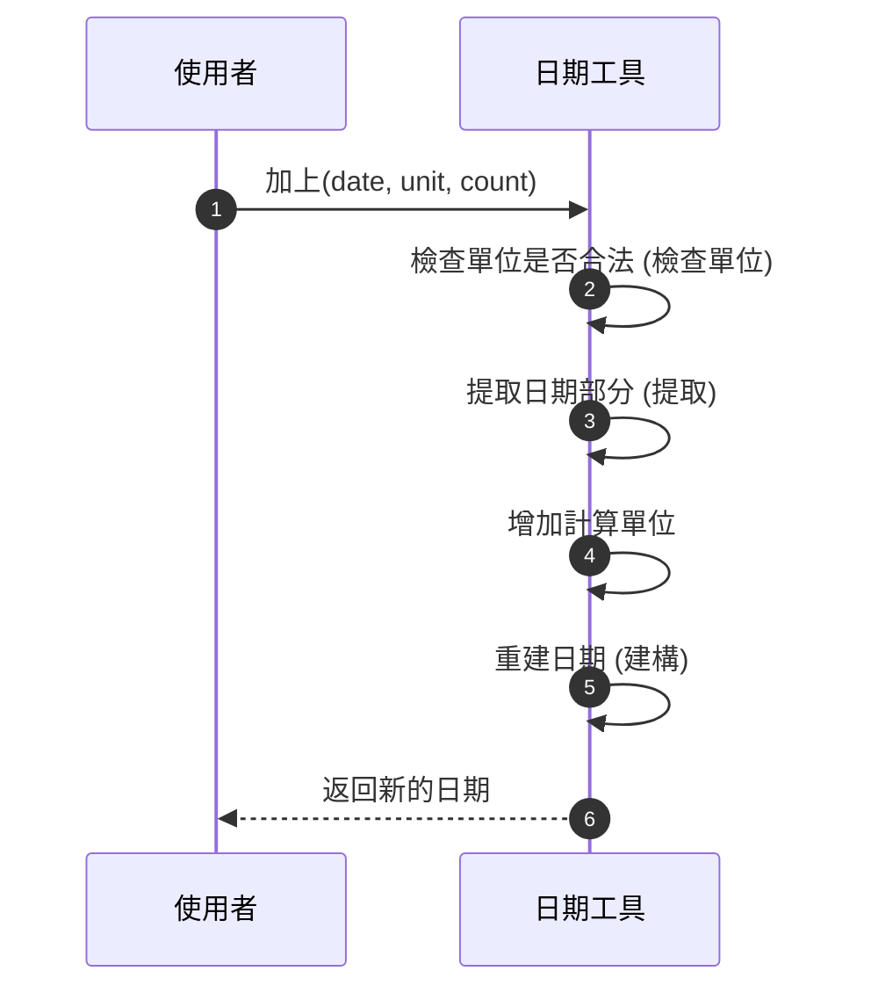

#### 程式邏輯

1. 驗證單位是否支援 (`檢查單位`)。
2. 使用 `提取` 提取日期的年月日時分秒。
3. 根據參數 `unit` 和 `count` 修改對應部分。
4. 使用 `建構` 方法返回新的日期。

---

### 減去

#### 功能概述

從給定日期中減去指定的單位數量 (如年、月、日等)，返回新的日期。

#### 技術結構

1. 檢查日期有效性。
2. 驗證單位是否支援。
3. 根據單位在日期上執行減法。

#### 參數規格與回傳

| 參數名稱 | 類型   | 描述                                 | 必要性 |
| -------- | ------ | ------------------------------------ | ------ |
| 日期     | Date   | 原始日期                             | 是     |
| 單位     | String | 要減去的單位 (如 `year`、`month` 等) | 是     |
| 數量     | Number | 減去的數量                           | 是     |

| 回傳值 | 類型 | 描述                   |
| ------ | ---- | ---------------------- |
| date   | Date | 減去指定單位後的新日期 |

#### 循序圖

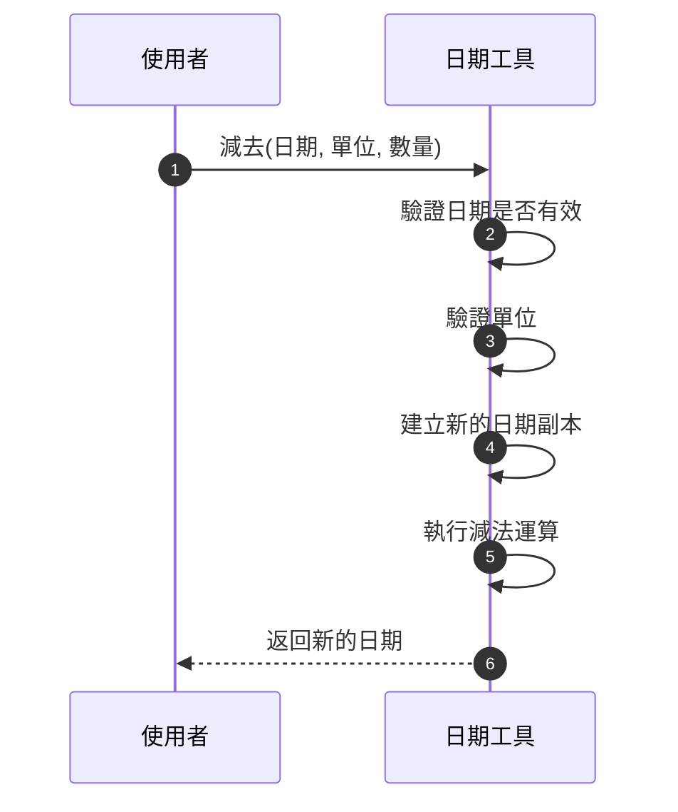

#### 程式邏輯

1. 確保參數 `日期` 是有效的日期物件。
2. 驗證 `單位` 是否在支援的列表內。
3. 根據減去的單位和數量計算返回新日期。

---

### 格式化日期

#### 功能概述

將給定的日期按照指定的格式進行格式化，返回格式化後的日期字串。

#### 技術結構

1. 檢查日期與格式字串的有效性。
2. 提取日期的部分並進行格式替換 (如 `YYYY` → 年份)。
3. 返回格式化後的字串。

#### 參數規格與回傳

| 參數名稱 | 類型   | 描述                         | 必要性 |
| -------- | ------ | ---------------------------- | ------ |
| date     | Date   | 要格式化的日期               | 是     |
| format   | String | 格式化字串 (如 `YYYY-MM-DD`) | 是     |

| 回傳值       | 類型   | 描述               |
| ------------ | ------ | ------------------ |
| formattedStr | String | 格式化後的日期字串 |

#### 循序圖

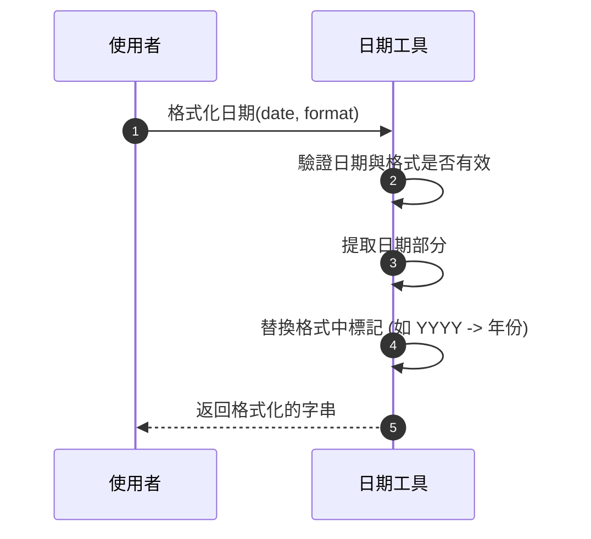

#### 程式邏輯

1. 根據指定的格式，解析出日期各部分。
2. 運用正規表達式替換格式。

---

### 取得中文星期名稱

#### 功能概述

根據給定的日期，返回對應的中文星期名稱 (如「星期一」)。

#### 技術結構

1. 確保輸入為有效的 `Date` 物件。
2. 透過 `getDay()` 方法獲取週幾。
3. 返回全稱或簡稱名稱。

#### 參數規格與回傳

| 參數名稱 | 類型    | 描述                                 | 必要性 |
| -------- | ------- | ------------------------------------ | ------ |
| date     | Date    | 要查詢星期名稱的日期                 | 是     |
| isShort  | Boolean | 是否返回簡稱 (預設 `false` 返回全稱) | 否     |

| 回傳值 | 類型   | 描述               |
| ------ | ------ | ------------------ |
| week   | String | 日期對應的星期名稱 |

#### 循序圖

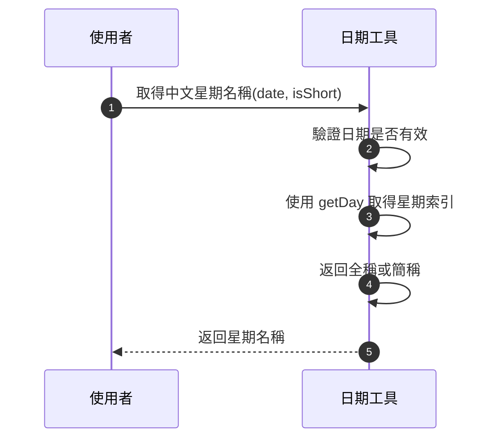

#### 程式邏輯

1. 檢查 `date` 是否為 `Date` 物件。
2. 調用 `getDay` 方法取得星期索引。
3. 根據 `isShort` 返回全稱或簡稱。

---

### 取得年份尾數

#### 功能概述

返回指定日期的年份尾兩位數 (如 2023 → 23)。

#### 技術結構

1. 確保輸入是有效的 `Date` 物件。
2. 使用年份的字串操作提取尾兩位。

#### 參數規格與回傳

| 參數名稱 | 類型 | 描述             | 必要性 |
| -------- | ---- | ---------------- | ------ |
| date     | Date | 要操作的日期物件 | 是     |

| 回傳值 | 類型   | 描述             |
| ------ | ------ | ---------------- |
| year   | String | 年份的尾兩位數字 |

#### 循序圖

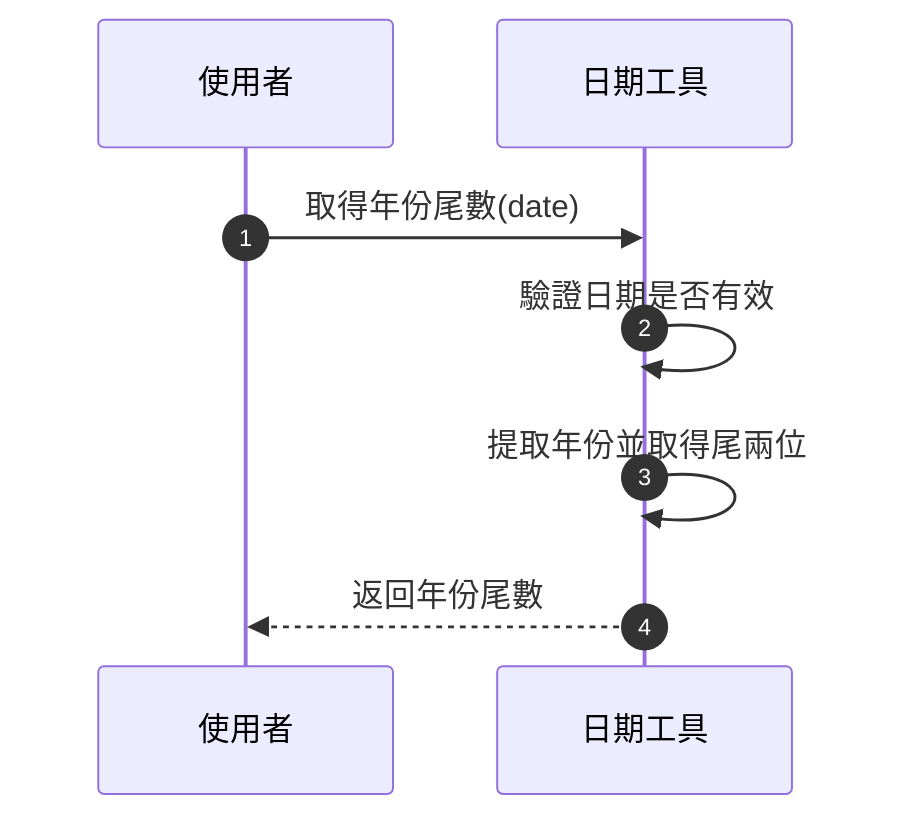

#### 程式邏輯

1. 驗證輸入 `date` 是否是有效的 `Date` 物件。
2. 使用 `.getFullYear().toString().slice(-2)` 提取年份尾數。
3. 返回結果。

---

### 是否為有效日期字串

#### 功能概述

檢查輸入的字串是否為有效的日期格式。

#### 技術結構

1. 驗證參數是否為字串。
2. 嘗試將字串轉為日期並檢查是否為有效日期。

#### 參數規格與回傳

| 參數名稱   | 類型   | 描述             | 必要性 |
| ---------- | ------ | ---------------- | ------ |
| dateString | String | 欲檢查的日期字串 | 是     |

| 回傳值 | 類型    | 描述                      |
| ------ | ------- | ------------------------- |
| result | Boolean | `true` 表示為有效日期字串 |

#### 循序圖

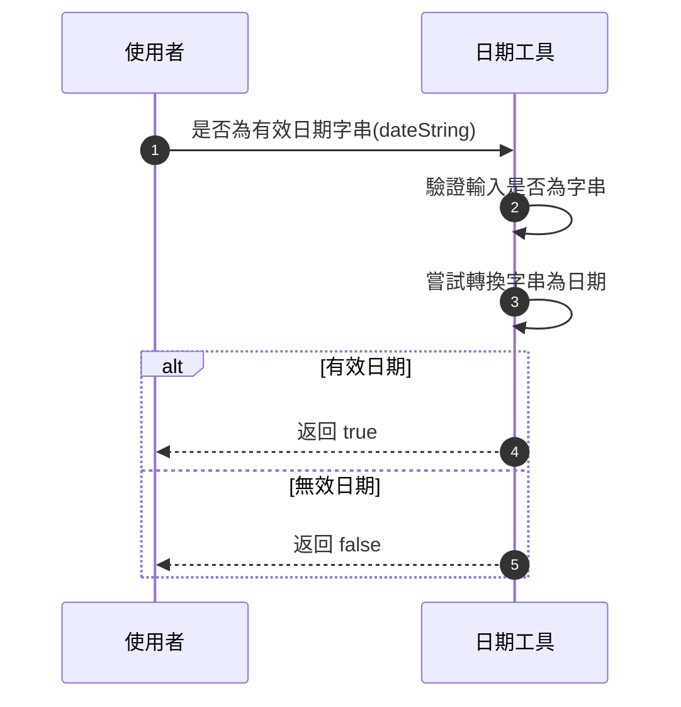

#### 程式邏輯

1. 檢查 `dateString` 是否為字串，若非字串則返回 `false`。
2. 嘗試將字串轉為日期物件。
3. 使用 `isNaN(date.getTime())` 核查其有效性，並返回布林值。

---

### 在範圍內

#### 功能概述

檢查給定日期是否落在指定的日期範圍內 (包含邊界)。

#### 技術結構

1. 確保所有輸入為有效的 `Date` 物件。
2. 比較日期範圍，返回結果。

#### 參數規格與回傳

| 參數名稱 | 類型 | 描述                     | 必要性 |
| -------- | ---- | ------------------------ | ------ |
| 日期     | Date | 要檢查是否在範圍內的日期 | 是     |
| 開始     | Date | 範圍的起始日期           | 是     |
| 結束     | Date | 範圍的結束日期           | 是     |

| 回傳值 | 類型    | 描述                      |
| ------ | ------- | ------------------------- |
| result | Boolean | 是否在日期範圍內 (含邊界) |

#### 循序圖

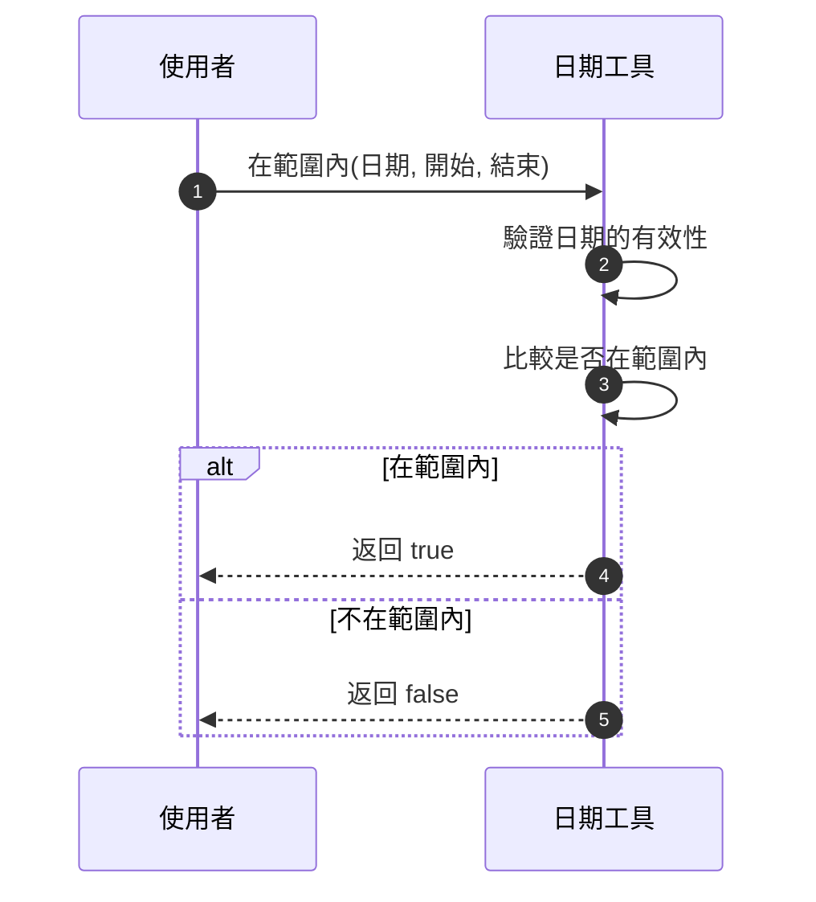

#### 程式邏輯

1. 驗證 `日期`、`開始`、`結束` 是否為有效 `Date` 物件。
2. 確保範圍的起點 (`開始`) 在終點 (`結束`) 之前。
3. 比較目標日期是否落在範圍內，返回布林值。

---

### 解析

#### 功能概述

根據指定的日期格式字串 (如 `YYYY-MM-DD`)，將日期字串解析為 `Date` 物件。

#### 技術結構

1. 使用內建 `Date` API 和正則表達式匹配格式。
2. 提取各日期部分後重建日期物件。

#### 參數規格與回傳

| 參數名稱   | 類型   | 描述                       | 必要性 |
| ---------- | ------ | -------------------------- | ------ |
| dateString | String | 欲解析的日期字串           | 是     |
| format     | String | 日期格式 (如 `YYYY-MM-DD`) | 是     |

| 回傳值 | 類型 | 描述             |
| ------ | ---- | ---------------- |
| date   | Date | 解析後的日期物件 |

#### 循序圖

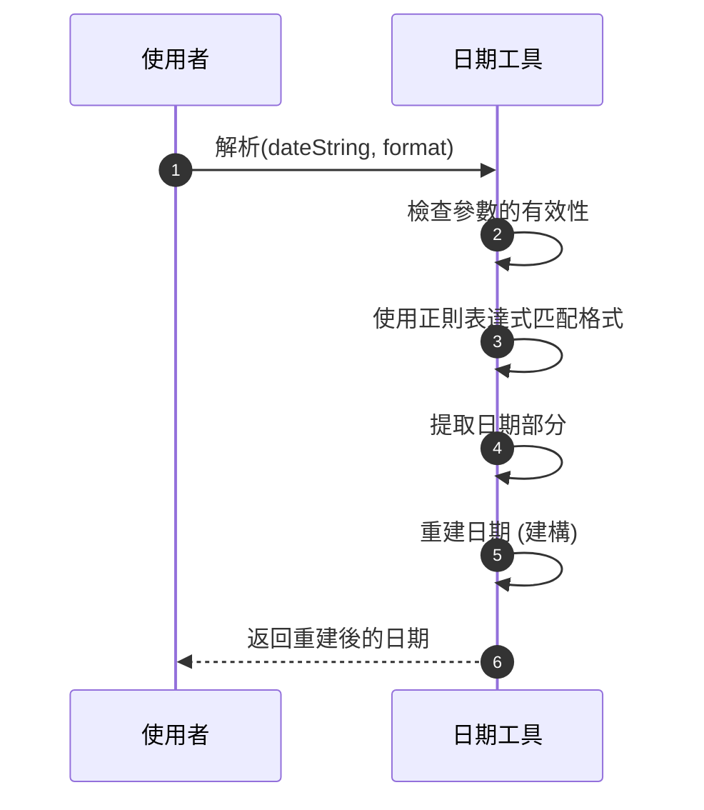

#### 程式邏輯

1. 檢查 `dateString` 和 `format` 是否正確。
2. 使用正規表達式提取 `dateString` 中的日期部分。
3. 將提取的資料重建成新的 `Date` 物件並返回。

---

### 取得年份尾數

#### 功能概述

返回指定日期的年份尾兩位數 (如 2023 → 23)。

#### 技術結構

1. 確保輸入是有效的 `Date` 物件。
2. 使用年份的字串操作提取尾兩位。

#### 參數規格與回傳

| 參數名稱 | 類型 | 描述             | 必要性 |
| -------- | ---- | ---------------- | ------ |
| date     | Date | 要操作的日期物件 | 是     |

| 回傳值 | 類型   | 描述             |
| ------ | ------ | ---------------- |
| year   | String | 年份的尾兩位數字 |

#### 循序圖

#### 程式邏輯

1. 驗證輸入 `date` 是否是有效的 `Date` 物件。
2. 使用 `.getFullYear().toString().slice(-2)` 提取年份尾數。
3. 返回結果。

---

### 是否為有效日期字串

#### 功能概述

檢查輸入的字串是否為有效的日期格式。

#### 技術結構

1. 驗證參數是否為字串。
2. 嘗試將字串轉為日期並檢查是否為有效日期。

#### 參數規格與回傳

| 參數名稱   | 類型   | 描述             | 必要性 |
| ---------- | ------ | ---------------- | ------ |
| dateString | String | 欲檢查的日期字串 | 是     |

| 回傳值 | 類型    | 描述                      |
| ------ | ------- | ------------------------- |
| result | Boolean | `true` 表示為有效日期字串 |

#### 循序圖

#### 程式邏輯

1. 檢查 `dateString` 是否為字串，若非字串則返回 `false`。
2. 嘗試將字串轉為日期物件。
3. 使用 `isNaN(date.getTime())` 核查其有效性，並返回布林值。

---

### 在範圍內

#### 功能概述

檢查給定日期是否落在指定的日期範圍內 (包含邊界)。

#### 技術結構

1. 確保所有輸入為有效的 `Date` 物件。
2. 比較日期範圍，返回結果。

#### 參數規格與回傳

| 參數名稱 | 類型 | 描述                     | 必要性 |
| -------- | ---- | ------------------------ | ------ |
| 日期     | Date | 要檢查是否在範圍內的日期 | 是     |
| 開始     | Date | 範圍的起始日期           | 是     |
| 結束     | Date | 範圍的結束日期           | 是     |

| 回傳值 | 類型    | 描述                      |
| ------ | ------- | ------------------------- |
| result | Boolean | 是否在日期範圍內 (含邊界) |

#### 循序圖

#### 程式邏輯

1. 驗證 `日期`、`開始`、`結束` 是否為有效 `Date` 物件。
2. 確保範圍的起點 (`開始`) 在終點 (`結束`) 之前。
3. 比較目標日期是否落在範圍內，返回布林值。

---

### 解析

#### 功能概述

根據指定的日期格式字串 (如 `YYYY-MM-DD`)，將日期字串解析為 `Date` 物件。

#### 技術結構

1. 使用內建 `Date` API 和正則表達式匹配格式。
2. 提取各日期部分後重建日期物件。

#### 參數規格與回傳

| 參數名稱   | 類型   | 描述                       | 必要性 |
| ---------- | ------ | -------------------------- | ------ |
| dateString | String | 欲解析的日期字串           | 是     |
| format     | String | 日期格式 (如 `YYYY-MM-DD`) | 是     |

| 回傳值 | 類型 | 描述             |
| ------ | ---- | ---------------- |
| date   | Date | 解析後的日期物件 |

#### 循序圖

#### 程式邏輯

1. 檢查 `dateString` 和 `format` 是否正確。
2. 使用正規表達式提取 `dateString` 中的日期部分。
3. 將提取的資料重建成新的 `Date` 物件並返回。

---

### 建構

#### 功能概述

根據給定的日期組件重新建立一個 `Date` 物件。

#### 技術結構

1. 接收包含日期各部分的物件。
2. 使用 JS 原生 `Date` API 構建新物件。

#### 參數規格與回傳

| 參數名稱 | 類型   | 描述                            | 必要性 |
| -------- | ------ | ------------------------------- | ------ |
| parts    | Object | 包含日期部分的物件 (如年、月等) | 是     |

| 回傳值 | 類型 | 描述             |
| ------ | ---- | ---------------- |
| date   | Date | 構建的新日期物件 |

#### 循序圖

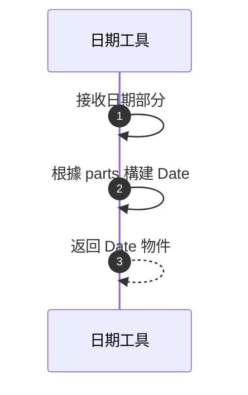

#### 程式邏輯

1. 從 `parts` 提取年、月、日等部分。
2. 調用 `Date` 生成新物件。

---

### 檢查單位

#### 功能概述

檢查輸入的日期單位是否支援 (如 `year`、`month` 等)。

#### 技術結構

使用內建單位列表 `Units` 驗證單位。

#### 參數規格與回傳

| 參數名稱 | 類型   | 描述                 | 必要性 |
| -------- | ------ | -------------------- | ------ |
| 單位     | String | 要檢查是否支援的單位 | 是     |

| 回傳值 | 類型 | 描述                       |
| ------ | ---- | -------------------------- |
| 無     | 無   | 不返回，但若無效將拋出錯誤 |

#### 循序圖

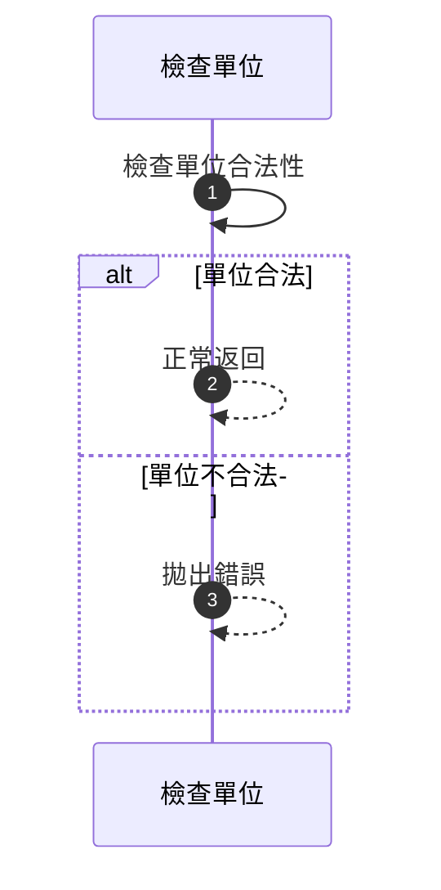

#### 程式邏輯

1. 使用 `Units` 列表檢查目標單位是否存在。
2. 若存在，則返回正常流程；否則拋出錯誤。

---

### 提取

#### 功能概述

從指定的日期物件中提取所有部分，包括年、月、日、時、分、秒和毫秒。

#### 技術結構

透過 `Date` 的原生方法提取日期屬性。

#### 參數規格與回傳

| 參數名稱 | 類型 | 描述             | 必要性 |
| -------- | ---- | ---------------- | ------ |
| 日期     | Date | 欲提取部分的日期 | 是     |

| 回傳值 | 類型   | 描述                   |
| ------ | ------ | ---------------------- |
| parts  | Object | 包含日期全部細節的物件 |

#### 循序圖

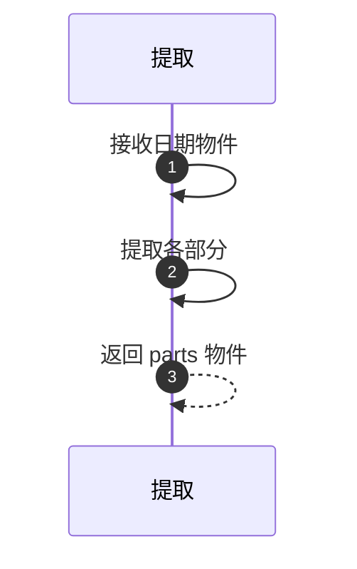

#### 程式邏輯

1. 從輸入日期提取年、月、日等部分。
2. 返回包含所有部分的物件。

---

#### 功能概述

從指定的日期物件中提取所有部分，包括年、月、日、時、分、秒和毫秒。

#### 技術結構

透過 `Date` 的原生方法提取日期屬性。

#### 參數規格與回傳

| 參數名稱 | 類型 | 描述             | 必要性 |
| -------- | ---- | ---------------- | ------ |
| 日期     | Date | 欲提取部分的日期 | 是     |

| 回傳值 | 類型   | 描述                   |
| ------ | ------ | ---------------------- |
| parts  | Object | 包含日期全部細節的物件 |

#### 循序圖

#### 程式邏輯

1. 從輸入日期提取年、月、日等部分。
2. 返回包含所有部分的物件。
